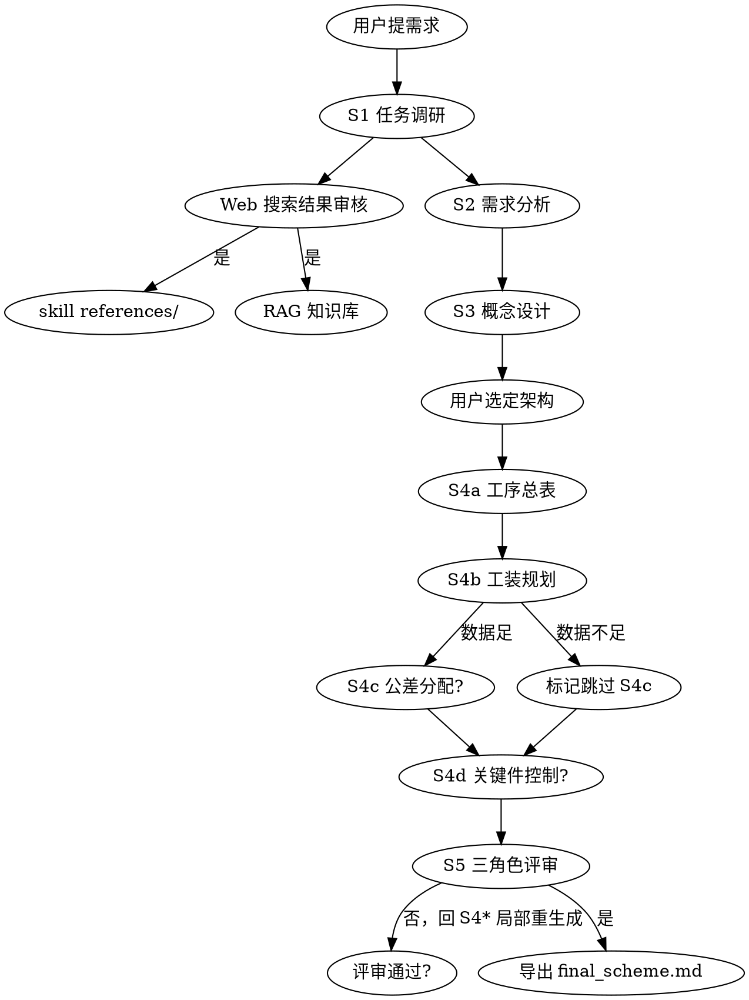

# Assembly-Scheme Skill — Plan 1 (Phase 1 + Phase 2) Implementation Plan

> **For agentic workers:** REQUIRED SUB-SKILL: Use superpowers:subagent-driven-development (recommended) or superpowers:executing-plans to implement this plan task-by-task. Steps use checkbox (`- [ ]`) syntax for tracking.

**Goal:** Build the skeleton of the `aero-engine-assembly-scheme` skill (Phase 1) and a working v0 backend pipeline that can run S1 (intake + research) end-to-end (Phase 2). After this plan completes, the system can accept a "design assembly scheme for X" request, run KG snapshot + Web search + LLM, and return a structured `stage1.json` + `task_card_md`.

**Architecture:** Three-layer architecture from spec §1.2 — (1) `skills/aero-engine-assembly-scheme/` is the source-of-truth methodology; (2) `backend/pipelines/assembly_scheme/` orchestrates LLM + tools per stage; (3) frontend deferred to Plan 2. Plan 1 implements only S1 backend; remaining 7 stages return HTTP 501.

**Tech Stack:** Python 3.10 / FastAPI / Pydantic / pytest / Tavily SDK (`tavily-python`) / `jsonschema` / PyYAML (already installed) / Neo4j driver (already installed).

**Spec reference:** `docs/superpowers/specs/2026-05-08-assembly-scheme-skill-design.md` §§1, 2.1, 4.1-4.5, 5.1-5.4, 5.5 (P1+P2)

**Conventions:**
- All Python commands run from repo root with conda env `rag_demo` activated. Bash form: `PYTHONUTF8=1 python ...`. PowerShell form: `$env:PYTHONUTF8="1"; python ...`. Use whichever matches your shell.
- All test runs target `tests/assembly/` per this plan; use `-v` for verbose output.
- All commits should pass tests before being made. If a test fails after an implementation step, fix the implementation in a follow-up step before committing.

---

## File Structure

### Created in this plan

```
skills/                                                    # NEW top-level dir
└── aero-engine-assembly-scheme/
    ├── SKILL.md                                          # Main entry, frontmatter + checklist
    ├── methodology/
    │   ├── s1_intake_and_research.md                     # Full content
    │   ├── s2_requirements_qfd.md                        # Outline only (v1)
    │   ├── s3_concept_architecture.md                    # Outline only
    │   ├── s4_detailed_process.md                        # Outline only
    │   └── s5_review_and_export.md                       # Outline only
    ├── templates/
    │   ├── schemas/
    │   │   ├── stage1.schema.json                        # Full
    │   │   ├── stage2.schema.json                        # Minimal placeholder
    │   │   ├── stage3.schema.json                        # Minimal placeholder
    │   │   ├── stage4a.schema.json                       # Minimal placeholder
    │   │   ├── stage4b.schema.json                       # Minimal placeholder
    │   │   ├── stage4c.schema.json                       # Minimal placeholder (with skipped flag)
    │   │   ├── stage4d.schema.json                       # Minimal placeholder (with skipped flag)
    │   │   └── stage5.schema.json                        # Minimal placeholder
    │   └── golden/
    │       └── pt6a_hpc_stage1.json                      # PT6A HPC S1 example
    ├── references/
    │   ├── standards/
    │   │   └── _index.md                                 # Auto-maintained index (initial)
    │   ├── case_studies/
    │   │   └── _index.md
    │   └── _ingest_log.json                              # Empty array initially
    └── prompts/
        └── s1_intake.prompt.md                           # Full S1 prompt template

backend/
├── tools/
│   ├── __init__.py                                       # Empty
│   └── web_search.py                                     # Tavily wrapper + cache
├── pipelines/
│   └── assembly_scheme/
│       ├── __init__.py                                   # Empty
│       ├── skill_loader.py                               # SkillRegistry class
│       └── stage1_intake.py                              # run_stage1_intake fn
└── routers/
    └── assembly_design.py                                # 7 endpoints (only stage 1 active)

storage/
├── assembly_schemes/                                     # Output dir for schemes
│   └── .gitkeep
└── web_cache/                                            # Tavily query cache
    └── .gitkeep

tests/
└── assembly/
    ├── __init__.py                                       # Empty
    ├── conftest.py                                       # Shared fixtures
    ├── test_web_search.py
    ├── test_skill_loader.py
    ├── test_stage1_intake.py
    └── test_assembly_design_router.py
```

### Modified

| File | Change |
|------|--------|
| `requirements.txt` | Add `jsonschema>=4.0`, `tavily-python>=0.3` |
| `.env.example` | Add `TAVILY_API_KEY=` placeholder |
| `backend/state.py` | Add `web_search_client`, `skill_registry`, `assembly_lock` fields to `AppState` |
| `backend/main.py` | lifespan: load skill registry + init web_search_client; register `assembly_design` router |

---

## Tasks Overview

| # | Task | Phase | Time |
|---|------|-------|------|
| 1 | Bootstrap dirs + dependencies | P1 | 5min |
| 2 | Write SKILL.md (main entry) | P1 | 15min |
| 3 | Write 5 methodology files | P1 | 20min |
| 4 | Write 8 JSON schemas | P1 | 25min |
| 5 | Write s1_intake prompt template | P1 | 10min |
| 6 | Implement SkillRegistry loader (TDD) | P1 | 30min |
| 7 | Write pt6a_hpc_stage1.json golden example | P1 | 20min |
| 8 | Implement WebSearchClient (TDD) | P2 | 35min |
| 9 | Extend AppState with new fields | P2 | 10min |
| 10 | Implement run_stage1_intake (TDD) | P2 | 40min |
| 11 | Implement assembly_design router (TDD) | P2 | 40min |
| 12 | Wire into main.py lifespan + register router | P2 | 20min |
| 13 | E2E smoke test + PROJECT_GUIDE.md update | P2 | 25min |

---

# Phase 1: Skill Scaffold

## Task 1: Bootstrap directories and dependencies

**Files:**
- Create: `skills/aero-engine-assembly-scheme/methodology/`
- Create: `skills/aero-engine-assembly-scheme/templates/schemas/`
- Create: `skills/aero-engine-assembly-scheme/templates/golden/`
- Create: `skills/aero-engine-assembly-scheme/references/standards/`
- Create: `skills/aero-engine-assembly-scheme/references/case_studies/`
- Create: `skills/aero-engine-assembly-scheme/prompts/`
- Create: `storage/assembly_schemes/.gitkeep`
- Create: `storage/web_cache/.gitkeep`
- Create: `tests/assembly/__init__.py`
- Create: `backend/tools/__init__.py`
- Create: `backend/pipelines/assembly_scheme/__init__.py`
- Modify: `requirements.txt`
- Modify: `.env.example`

- [ ] **Step 1: Create empty directory tree**

```bash
mkdir -p skills/aero-engine-assembly-scheme/methodology
mkdir -p skills/aero-engine-assembly-scheme/templates/schemas
mkdir -p skills/aero-engine-assembly-scheme/templates/golden
mkdir -p skills/aero-engine-assembly-scheme/references/standards
mkdir -p skills/aero-engine-assembly-scheme/references/case_studies
mkdir -p skills/aero-engine-assembly-scheme/prompts
mkdir -p storage/assembly_schemes
mkdir -p storage/web_cache
mkdir -p tests/assembly
mkdir -p backend/tools
mkdir -p backend/pipelines/assembly_scheme
```

PowerShell equivalent (run separately):

```powershell
New-Item -ItemType Directory -Force -Path skills\aero-engine-assembly-scheme\methodology, skills\aero-engine-assembly-scheme\templates\schemas, skills\aero-engine-assembly-scheme\templates\golden, skills\aero-engine-assembly-scheme\references\standards, skills\aero-engine-assembly-scheme\references\case_studies, skills\aero-engine-assembly-scheme\prompts, storage\assembly_schemes, storage\web_cache, tests\assembly, backend\tools, backend\pipelines\assembly_scheme
```

- [ ] **Step 2: Create empty `__init__.py` and `.gitkeep` files**

Create the following empty files:
- `tests/assembly/__init__.py`
- `backend/tools/__init__.py`
- `backend/pipelines/assembly_scheme/__init__.py`
- `storage/assembly_schemes/.gitkeep`
- `storage/web_cache/.gitkeep`

(Empty files; just ensure they exist.)

- [ ] **Step 3: Append dependencies to `requirements.txt`**

Add these two lines at the end of `requirements.txt`:

```
jsonschema>=4.0
tavily-python>=0.3
```

- [ ] **Step 4: Append `TAVILY_API_KEY` to `.env.example`**

Add this section at the end of `.env.example`:

```
# ===== Web Search (Tavily, optional) =====
# Free tier: 1000 queries/month. Sign up at https://tavily.com
# When unset, web_search returns empty results (S1 still runs with local data only).
TAVILY_API_KEY=
```

- [ ] **Step 5: Install new dependencies**

```bash
pip install "jsonschema>=4.0" "tavily-python>=0.3"
```

Verify both import successfully:

```bash
python -c "import jsonschema; import tavily; print('OK')"
```

Expected: `OK`

- [ ] **Step 6: Commit**

```bash
git add skills/ storage/assembly_schemes/.gitkeep storage/web_cache/.gitkeep tests/assembly/__init__.py backend/tools/__init__.py backend/pipelines/assembly_scheme/__init__.py requirements.txt .env.example
git commit -m "chore(assembly-scheme): bootstrap skill dirs and add jsonschema+tavily deps"
```

---

## Task 2: Write SKILL.md (main entry)

**Files:**
- Create: `skills/aero-engine-assembly-scheme/SKILL.md`
- Create: `tests/assembly/test_skill_loader.py` (placeholder, expanded in Task 6)

- [ ] **Step 1: Write `SKILL.md`**

Create `skills/aero-engine-assembly-scheme/SKILL.md` with this exact content:

````markdown
---
name: aero-engine-assembly-scheme
description: 用于设计航空发动机子系统装配方案的端到端工作流。触发时机：用户提出"为 X 设计装配方案 / 装配工艺 / 装配规程"、"做装配方案设计"、或在装配/工艺工程语境下提出方案级问题。包含 5 阶段方法论（任务调研→需求分析→概念设计→详细工艺→评审导出），双轨 HITL，Web 反哺。范围聚焦子系统级（如 PT6A HPC），不处理整机总体设计。
type: domain-workflow
target_subsystem_default: PT6A HPC
version: 1.0
---

# 航空发动机装配方案设计 Skill

## 触发与不触发

**触发**：装配方案、装配工艺规程、装配顺序设计、工装规划、QC 点设置、关键尺寸链、装配公差分配、关键件特殊控制
**不触发**：单点工艺问题（直接用 RAG 回答）、KG 构建本身（用 KgBuilder）、整机总体设计

## 核心 Checklist（每阶段必做）

- [ ] 读取上一阶段 JSON 产物（S1 除外）
- [ ] 加载对应 `methodology/sN_*.md` 作为方法论上下文
- [ ] 按 `prompts/sN_*.prompt.md` 模板执行
- [ ] 产物校验通过 `templates/schemas/stage{stage_key}.schema.json`
- [ ] HITL 暂停，等待用户编辑或自然语言指导意见
- [ ] 用户确认后写入 `storage/assembly_schemes/{scheme_id}/stage{stage_key}.json`

## 5 阶段决策图



## 关键反模式

- ❌ **跳过 S2 直接出工序**：会丢失需求追溯，QC 覆盖不全
- ❌ **S3 只给 1 个架构**：违反"概念设计需多备选"原则，至少 3 个
- ❌ **S4a 一次性生成全部工序展开**：token 爆炸 + 工序间冲突难检测，应先总表后展开
- ❌ **把 Web 搜索结果直接当事实写入产物**：必须先经用户审核
- ❌ **S4c/S4d 数据不足却强行编造**：必须明确标记 `skipped: true` + `skip_reason`
- ❌ **公差链分析省略**：航发装配的灵魂——叶尖间隙、轴向间隙等关键间隙必须做 stack-up
- ❌ **不做 DFM/DFA 评分**：零件设计有 DFA 缺陷不可能装出好方案

## 5 阶段产物 ID 约定

| 阶段 | stage_key | 产物文件 | Schema |
|------|-----------|----------|--------|
| S1 任务调研 | `1` | `stage1.json` | `stage1.schema.json` |
| S2 需求分析 | `2` | `stage2.json` | `stage2.schema.json` |
| S3 概念设计 | `3` | `stage3.json` | `stage3.schema.json` |
| S4a 工序总表 | `4a` | `stage4a.json` | `stage4a.schema.json` |
| S4b 工装规划 | `4b` | `stage4b.json` | `stage4b.schema.json` |
| S4c 公差分配（可跳过） | `4c` | `stage4c.json` | `stage4c.schema.json` |
| S4d 关键件控制（可跳过） | `4d` | `stage4d.json` | `stage4d.schema.json` |
| S5 评审导出 | `5` | `stage5.json` + `final_scheme.md` | `stage5.schema.json` |

## 工具调度（Layer 2 责任）

| 工具 | 来源 | 用于阶段 |
|------|------|---------|
| `kg_query` | Neo4j (existing) | S1, S3, S4a, S4b |
| `rag_search` | Qdrant + BM25 (existing) | S1, S4a-d |
| `cad_query` | pythonocc (existing) | S3, S4c |
| `web_search` | Tavily wrapper (new) | S1, S5 (按需) |
| `vision_describe` | MiniMax Vision (existing) | S1 (用户上传草图时) |

## 反哺写入规则

Web 搜索结果经用户审核后，根据"目的地"标签写入：
- `references/`：方法论/标准条款级 → 写 markdown + 在 `_index.md` 追加索引
- `data/web_corpus/{topic}/`：具体事实级 → 走 `/ingest/pipeline` 入库到 RAG

每条写入记录追加到 `references/_ingest_log.json`。
````

- [ ] **Step 2: Create placeholder test file**

Create `tests/assembly/test_skill_loader.py` with this exact content (will be expanded in Task 6):

```python
"""Tests for backend.pipelines.assembly_scheme.skill_loader.SkillRegistry."""
from pathlib import Path
import pytest

SKILL_ROOT = Path(__file__).resolve().parents[2] / "skills" / "aero-engine-assembly-scheme"


def test_skill_md_exists():
    assert (SKILL_ROOT / "SKILL.md").exists(), "SKILL.md missing"


def test_skill_md_has_frontmatter():
    content = (SKILL_ROOT / "SKILL.md").read_text(encoding="utf-8")
    assert content.startswith("---\n"), "SKILL.md must start with YAML frontmatter"
    assert "name: aero-engine-assembly-scheme" in content
    assert "version: 1.0" in content
```

- [ ] **Step 3: Run the tests**

```bash
PYTHONUTF8=1 python -m pytest tests/assembly/test_skill_loader.py -v
```

Expected: 2 PASS.

- [ ] **Step 4: Commit**

```bash
git add skills/aero-engine-assembly-scheme/SKILL.md tests/assembly/test_skill_loader.py
git commit -m "feat(assembly-scheme): add SKILL.md main entry with frontmatter and checklist"
```

---

## Task 3: Write 5 methodology files

**Files:**
- Create: `skills/aero-engine-assembly-scheme/methodology/s1_intake_and_research.md` (full)
- Create: `skills/aero-engine-assembly-scheme/methodology/s2_requirements_qfd.md` (outline)
- Create: `skills/aero-engine-assembly-scheme/methodology/s3_concept_architecture.md` (outline)
- Create: `skills/aero-engine-assembly-scheme/methodology/s4_detailed_process.md` (outline)
- Create: `skills/aero-engine-assembly-scheme/methodology/s5_review_and_export.md` (outline)

- [ ] **Step 1: Write `s1_intake_and_research.md` (full content)**

```markdown
# S1: 任务调研与资料采集 — 方法论

## 目的

把用户的"我要为 X 设计装配方案"模糊请求，翻译为结构化任务说明书，并集中拉取一次参考资料（本地 KG 快照 + Web 联网检索）。本阶段是后续 4 阶段的"输入契约"。

## 关键产物

`stage1.json`：含 subject / kg_snapshot / web_search_results / vision_notes / compliance_scope / task_card_md 六字段。

## 核心方法

### 1. 子系统识别与边界圈定
- 从用户输入提取系统名（中文 + 英文，如 "PT6A HPC" 与 "高压压气机"）
- 识别 scope（如"3 级轴流 + 1 级离心"），明确不在范围内的部分（避免任务无界扩张）
- 识别设计意图：新设计 / 工艺优化 / 复刻 / 故障改进
- 识别约束优先级：可靠性 / 维修性 / 成本 / 重量（最多 2 项 primary）

### 2. KG 快照（本地）
查询 Neo4j 已有该子系统的：
- Part / Assembly 实体计数
- 关键 hasInterface / matesWith 关系样本
- 已知 Procedure 与 Tool 关联

### 3. Web 联网检索（三组并发）
针对子系统名构造 3 类查询：
- 中文 + GJB：找国内标准条款
- 英文 + "assembly procedure"：找国际范例
- 具体型号 + "service bulletin"：找型号变更通告

### 4. 适航/质量体系合规性预筛
基于 subject 类型识别适用条款：
- AS9100D §8.1（风险管理）
- GJB 9001C §7.5（生产服务过程控制）
- 民航：ARP4754A、CCAR-33（发动机适航）
- 军用：GJB 1647A（型号研制规范）

### 5. 视觉素材解析（可选）
若用户上传草图/参考图片，调 Vision LLM 提取语义描述。

## 常见陷阱

- ❌ **scope 模糊**：未明确"哪些不在范围内"——后续 S3 概念设计会无限扩张
- ❌ **设计意图与约束冲突未暴露**：例如声称"工艺优化"但又要求"重新设计架构"
- ❌ **Web 搜索结果直接当事实**：必须经用户审核，标记 `selected: null` 等待审核
- ❌ **忽略本地 KG 已有内容**：导致重复劳动 + 与已有数据不一致

## 产物质量自检 Checklist

- [ ] subject.system 中英文都填写
- [ ] subject.scope 至少 2 项（含一项明确"不包含"）
- [ ] constraints.primary 单值字符串（非数组）
- [ ] kg_snapshot.part_count 为整数（即使 KG 不可用也要返回 0 + warning）
- [ ] web_search_results 每项含 id / url / title / excerpt / confidence / selected:null
- [ ] compliance_scope 至少 1 项
- [ ] task_card_md 含五栏：目标 / 范围 / 边界 / 约束 / 已知风险
```

- [ ] **Step 2: Write `s2_requirements_qfd.md` (outline)**

```markdown
# S2: 需求与约束分析 — 方法论（outline v1）

## 目的
把模糊目标转换成可量化指标，识别关键尺寸特征（KC），输出 DFM/DFA 评分。

## 核心方法（v1 待补完整内容）
1. **QFD-轻量法**：客户需求 → 工程指标 → 装配可控特征 三栏映射
2. **Boothroyd-Dewhurst DFA 评分**：理论最小零件数 / 实际零件数 → 装配效率
3. **KC 识别**：从需求倒推关键尺寸（如叶尖间隙）

## 产物字段
user_needs / engineering_metrics / assembly_features / key_characteristics / dfa_score / risks

## 留待 v2 完善
- DFA 计算公式与示例
- KC 识别决策树
- 历史 FMEA 数据接入方法
```

- [ ] **Step 3: Write `s3_concept_architecture.md` (outline)**

```markdown
# S3: 概念 / 架构设计 — 方法论（outline v1）

## 目的
在 S2 指标约束下，给出 3-5 个备选概念架构（模块划分 + 接口 + 装配单元），含装配仿真预检。

## 核心方法（v1 待补完整内容）
1. **功能-结构映射**：S2 engineering_metrics → 功能模块 → 物理组件
2. **装配树推导**：基于 KG isPartOf + matesWith 推导可行模块边界
3. **装配仿真预检**：KG/CAD 静态可达性分析（v2 升级到动态仿真）
4. **基准统一性审查**：工艺基准 / 装配基准 / 检测基准三者关系

## 产物字段
candidate_architectures（每个含 modules / key_interfaces / assembly_simulation / pros / cons / fit_score）/ recommended / rationale_md

## 留待 v2 完善
- 详细的 fit_score 计算
- 装配仿真接入 DELMIA/Process Simulate
```

- [ ] **Step 4: Write `s4_detailed_process.md` (outline covering 4 sub-modules)**

```markdown
# S4: 详细装配工艺方案 — 方法论（outline v1，覆盖 4a-4d）

## 4a 工序总表与顺序
- **Mickey Mouse 装配序列法**：基于配合层级 + 可达性的拓扑排序
- **DFA 启发式**：合并相似工序、最小化翻转、就近原则

## 4b 工装规划
- 通用工装库优先（降本）+ 专用工装设计（关键工序）
- 工装的工艺性反馈

## 4c 公差分配（可跳过）
- **ASME B89.7.5 stack-up**：最坏情况 / RSS / 蒙特卡罗三法对比
- 反向公差分配：从 KC 目标 → 各零件 GD&T 容差

## 4d 关键件特殊控制（可跳过）
- **转子动平衡**：一阶/二阶刚性 vs 柔性
- **选配/配磨/配研**：盘-轴热套等关键配合
- **预紧力管理**：屈服扭矩 + 椭圆系数 + 温度修正
- **关键件追溯性**：AS9100 全生命周期记录
- **FOD 控制**：异物管控分级

## 跳过准则
- 4c 跳过：缺少完整 GD&T 数据 / 无具体 KC 量化目标
- 4d 跳过：无关键件清单 / 无动平衡/选配工艺数据
- 跳过必须填 skip_reason 且不杜撰任何数字
```

- [ ] **Step 5: Write `s5_review_and_export.md` (outline)**

```markdown
# S5: 方案评审与导出 — 方法论（outline v1）

## 三角色虚拟评审
- **工艺工程师**：检查工序冲突、工装重复、QC 覆盖
- **质量工程师**：检查 QC 点是否覆盖 KC、规范引用正确
- **设计工程师**：检查方案是否回应 S2 所有指标

## 追溯性矩阵
KC → 工序 → QC → 检验记录的四列对照表，每个 KC 必须可追溯到至少一个 QC。

## 虚拟试装迭代
评审发现的 high severity 问题 → 标记 `iterate_to: stage4*` → 触发局部重生成。

## 留待 v2 完善
- FMEA 简版评分细则
- final_scheme.md → PDF（pandoc）
```

- [ ] **Step 6: Run tests (file existence)**

```bash
PYTHONUTF8=1 python -c "from pathlib import Path; root = Path('skills/aero-engine-assembly-scheme/methodology'); names = ['s1_intake_and_research', 's2_requirements_qfd', 's3_concept_architecture', 's4_detailed_process', 's5_review_and_export']; missing = [n for n in names if not (root / f'{n}.md').exists()]; assert not missing, f'missing: {missing}'; print('OK')"
```

Expected: `OK`

- [ ] **Step 7: Commit**

```bash
git add skills/aero-engine-assembly-scheme/methodology/
git commit -m "feat(assembly-scheme): add 5 methodology files (S1 full, S2-S5 outline)"
```

---

## Task 4: Write 8 JSON schemas

**Files:**
- Create: `skills/aero-engine-assembly-scheme/templates/schemas/stage1.schema.json` (full)
- Create: `skills/aero-engine-assembly-scheme/templates/schemas/stage2.schema.json` (minimal)
- Create: `skills/aero-engine-assembly-scheme/templates/schemas/stage3.schema.json` (minimal)
- Create: `skills/aero-engine-assembly-scheme/templates/schemas/stage4a.schema.json` (minimal)
- Create: `skills/aero-engine-assembly-scheme/templates/schemas/stage4b.schema.json` (minimal)
- Create: `skills/aero-engine-assembly-scheme/templates/schemas/stage4c.schema.json` (minimal + skipped flag)
- Create: `skills/aero-engine-assembly-scheme/templates/schemas/stage4d.schema.json` (minimal + skipped flag)
- Create: `skills/aero-engine-assembly-scheme/templates/schemas/stage5.schema.json` (minimal)
- Create: `tests/assembly/test_schemas.py`

- [ ] **Step 1: Write `stage1.schema.json`**

Path: `skills/aero-engine-assembly-scheme/templates/schemas/stage1.schema.json`

```json
{
  "$schema": "https://json-schema.org/draft/2020-12/schema",
  "$id": "stage1.schema.json",
  "title": "Stage 1 — Intake & Research",
  "type": "object",
  "required": ["scheme_id", "subject", "kg_snapshot", "web_search_results", "compliance_scope", "task_card_md"],
  "properties": {
    "scheme_id": {"type": "string", "pattern": "^scheme-[0-9]{8}-[a-f0-9]{6}$"},
    "subject": {
      "type": "object",
      "required": ["system", "scope", "design_intent", "constraints"],
      "properties": {
        "system": {"type": "string", "minLength": 1},
        "system_en": {"type": "string"},
        "scope": {"type": "array", "items": {"type": "string"}, "minItems": 1},
        "design_intent": {"type": "string", "enum": ["新设计", "工艺优化", "复刻", "故障改进"]},
        "constraints": {
          "type": "object",
          "required": ["primary"],
          "properties": {
            "primary": {"type": "string"},
            "secondary": {"type": "string"}
          }
        }
      }
    },
    "kg_snapshot": {
      "type": "object",
      "required": ["part_count", "assembly_count"],
      "properties": {
        "part_count": {"type": "integer", "minimum": 0},
        "assembly_count": {"type": "integer", "minimum": 0},
        "key_interfaces": {"type": "array"},
        "relations_sample": {"type": "array"},
        "warning": {"type": "string"}
      }
    },
    "web_search_results": {
      "type": "array",
      "items": {
        "type": "object",
        "required": ["id", "url", "title", "excerpt", "confidence"],
        "properties": {
          "id": {"type": "string"},
          "url": {"type": "string"},
          "title": {"type": "string"},
          "excerpt": {"type": "string"},
          "confidence": {"type": "number", "minimum": 0, "maximum": 1},
          "selected": {"type": ["null", "object"]}
        }
      }
    },
    "vision_notes": {"type": "string"},
    "compliance_scope": {"type": "array", "items": {"type": "string"}, "minItems": 1},
    "task_card_md": {"type": "string", "minLength": 1}
  }
}
```

- [ ] **Step 2: Write `stage2.schema.json`**

Path: `skills/aero-engine-assembly-scheme/templates/schemas/stage2.schema.json`

```json
{
  "$schema": "https://json-schema.org/draft/2020-12/schema",
  "$id": "stage2.schema.json",
  "title": "Stage 2 — Requirements & Constraints (placeholder v1)",
  "type": "object",
  "required": ["user_needs", "engineering_metrics", "assembly_features", "key_characteristics", "risks"],
  "properties": {
    "user_needs": {"type": "array"},
    "engineering_metrics": {"type": "array"},
    "assembly_features": {"type": "array"},
    "key_characteristics": {"type": "array"},
    "dfa_score": {"type": "object"},
    "risks": {"type": "array"}
  }
}
```

- [ ] **Step 3: Write `stage3.schema.json`**

Path: `skills/aero-engine-assembly-scheme/templates/schemas/stage3.schema.json`

```json
{
  "$schema": "https://json-schema.org/draft/2020-12/schema",
  "$id": "stage3.schema.json",
  "title": "Stage 3 — Concept Architecture (placeholder v1)",
  "type": "object",
  "required": ["candidate_architectures", "recommended"],
  "properties": {
    "candidate_architectures": {"type": "array", "minItems": 1},
    "recommended": {"type": "string"},
    "rationale_md": {"type": "string"}
  }
}
```

- [ ] **Step 4: Write `stage4a.schema.json`**

Path: `skills/aero-engine-assembly-scheme/templates/schemas/stage4a.schema.json`

```json
{
  "$schema": "https://json-schema.org/draft/2020-12/schema",
  "$id": "stage4a.schema.json",
  "title": "Stage 4a — Procedures (placeholder v1)",
  "type": "object",
  "required": ["architecture_ref", "procedures"],
  "properties": {
    "architecture_ref": {"type": "string"},
    "procedures": {"type": "array"},
    "topology": {"type": "object"}
  }
}
```

- [ ] **Step 5: Write `stage4b.schema.json`**

Path: `skills/aero-engine-assembly-scheme/templates/schemas/stage4b.schema.json`

```json
{
  "$schema": "https://json-schema.org/draft/2020-12/schema",
  "$id": "stage4b.schema.json",
  "title": "Stage 4b — Tooling (placeholder v1)",
  "type": "object",
  "required": ["tooling"],
  "properties": {
    "tooling": {"type": "array"},
    "tooling_summary": {"type": "object"}
  }
}
```

- [ ] **Step 6: Write `stage4c.schema.json` (with skipped flag)**

Path: `skills/aero-engine-assembly-scheme/templates/schemas/stage4c.schema.json`

```json
{
  "$schema": "https://json-schema.org/draft/2020-12/schema",
  "$id": "stage4c.schema.json",
  "title": "Stage 4c — Tolerance Allocation (skippable, placeholder v1)",
  "type": "object",
  "required": ["skipped", "stack_ups"],
  "properties": {
    "skipped": {"type": "boolean"},
    "skip_reason": {"type": ["string", "null"]},
    "stack_ups": {"type": "array"}
  }
}
```

- [ ] **Step 7: Write `stage4d.schema.json` (with skipped flag)**

Path: `skills/aero-engine-assembly-scheme/templates/schemas/stage4d.schema.json`

```json
{
  "$schema": "https://json-schema.org/draft/2020-12/schema",
  "$id": "stage4d.schema.json",
  "title": "Stage 4d — Key Parts Special Control (skippable, placeholder v1)",
  "type": "object",
  "required": ["skipped"],
  "properties": {
    "skipped": {"type": "boolean"},
    "skip_reason": {"type": ["string", "null"]},
    "balancing": {"type": "object"},
    "select_fitting": {"type": "array"},
    "preload": {"type": "array"},
    "traceability_kcs": {"type": "array"},
    "fod_zones": {"type": "array"}
  }
}
```

- [ ] **Step 8: Write `stage5.schema.json`**

Path: `skills/aero-engine-assembly-scheme/templates/schemas/stage5.schema.json`

```json
{
  "$schema": "https://json-schema.org/draft/2020-12/schema",
  "$id": "stage5.schema.json",
  "title": "Stage 5 — Review & Export (placeholder v1)",
  "type": "object",
  "required": ["review_panel", "overall_score", "recommendation"],
  "properties": {
    "review_panel": {"type": "array"},
    "metrics_coverage": {"type": "object"},
    "kc_traceability_matrix": {"type": "array"},
    "overall_score": {"type": "number", "minimum": 0, "maximum": 5},
    "recommendation": {"type": "string", "enum": ["approved", "approved_with_revision", "rejected"]},
    "iterations": {"type": "array"},
    "export_path": {"type": "string"}
  }
}
```

- [ ] **Step 9: Write schema-validity test**

Path: `tests/assembly/test_schemas.py`

```python
"""Verify all 8 stage schemas are valid JSON Schema documents and stage1 validates a sample."""
from pathlib import Path
import json
import pytest
import jsonschema

SCHEMA_DIR = Path(__file__).resolve().parents[2] / "skills" / "aero-engine-assembly-scheme" / "templates" / "schemas"

ALL_SCHEMAS = [
    "stage1.schema.json", "stage2.schema.json", "stage3.schema.json",
    "stage4a.schema.json", "stage4b.schema.json", "stage4c.schema.json",
    "stage4d.schema.json", "stage5.schema.json",
]


@pytest.mark.parametrize("name", ALL_SCHEMAS)
def test_schema_is_valid_jsonschema(name):
    path = SCHEMA_DIR / name
    assert path.exists(), f"{name} missing"
    schema = json.loads(path.read_text(encoding="utf-8"))
    jsonschema.Draft202012Validator.check_schema(schema)


def test_stage1_schema_validates_sample():
    schema = json.loads((SCHEMA_DIR / "stage1.schema.json").read_text(encoding="utf-8"))
    sample = {
        "scheme_id": "scheme-20260508-a1b2c3",
        "subject": {
            "system": "PT6A 高压压气机",
            "system_en": "PT6A HPC",
            "scope": ["3 级轴流 + 1 级离心"],
            "design_intent": "工艺优化",
            "constraints": {"primary": "可靠性"},
        },
        "kg_snapshot": {"part_count": 35, "assembly_count": 13},
        "web_search_results": [],
        "compliance_scope": ["AS9100D §8.1"],
        "task_card_md": "## 任务说明书\nPT6A HPC ...",
    }
    jsonschema.validate(instance=sample, schema=schema)


def test_stage4c_schema_accepts_skipped():
    schema = json.loads((SCHEMA_DIR / "stage4c.schema.json").read_text(encoding="utf-8"))
    skipped = {"skipped": True, "skip_reason": "v1 GD&T data not available", "stack_ups": []}
    jsonschema.validate(instance=skipped, schema=schema)


def test_stage4d_schema_accepts_skipped():
    schema = json.loads((SCHEMA_DIR / "stage4d.schema.json").read_text(encoding="utf-8"))
    skipped = {"skipped": True, "skip_reason": "v1 key parts data not available"}
    jsonschema.validate(instance=skipped, schema=schema)
```

- [ ] **Step 10: Run tests, verify all pass**

```bash
PYTHONUTF8=1 python -m pytest tests/assembly/test_schemas.py -v
```

Expected: 11 PASS (8 parametrized + 3 individual).

- [ ] **Step 11: Commit**

```bash
git add skills/aero-engine-assembly-scheme/templates/schemas/ tests/assembly/test_schemas.py
git commit -m "feat(assembly-scheme): add 8 stage JSON schemas (stage1 full, others minimal v1)"
```

---

## Task 5: Write s1_intake prompt template

**Files:**
- Create: `skills/aero-engine-assembly-scheme/prompts/s1_intake.prompt.md`
- Create: `skills/aero-engine-assembly-scheme/references/standards/_index.md`
- Create: `skills/aero-engine-assembly-scheme/references/case_studies/_index.md`
- Create: `skills/aero-engine-assembly-scheme/references/_ingest_log.json`

- [ ] **Step 1: Write `s1_intake.prompt.md`**

Path: `skills/aero-engine-assembly-scheme/prompts/s1_intake.prompt.md`

```markdown
# System

你是航空发动机装配工艺资深专家，正在执行装配方案设计 skill 的 **S1 阶段（任务调研与资料采集）**。

你的目标：把用户的模糊需求翻译为结构化任务说明书，并整合本地 KG 快照与 Web 检索结果。

## 必须遵守

1. 输出严格符合 `templates/schemas/stage1.schema.json` —— 这是 JSON 契约，缺字段会校验失败
2. 每个事实性陈述必须可追溯到 KG 快照、Web 搜索结果之一；不确定时显式标注 "uncertainty: 高/中/低"
3. **绝不杜撰**型号参数、标准条款、零件清单。Web 搜索未命中时如实说明
4. 引用文献用 `[ref:standard_id]` 或 `[ref:web-ws-N]` 格式
5. `task_card_md` 必须含五栏：**目标 / 范围 / 边界 / 约束 / 已知风险**
6. `web_search_results` 中每条 `selected` 字段保持 `null`，由用户审核决定（不要填 true/false）

## 输入变量

- `subject_system`：用户给定的子系统名（中文）
- `subject_system_en`：英文名（可能为空）
- `subject_scope`：子系统范围数组
- `design_intent`：新设计 / 工艺优化 / 复刻 / 故障改进
- `constraints`：{primary: ..., secondary: ...}
- `kg_snapshot`：本地 KG 检索结果摘要
- `web_search_results`：Tavily 检索原始结果（已附 confidence）
- `vision_notes`：用户上传草图的 Vision 描述（可能为空）

## 输出格式

仅输出 JSON 对象，不要 markdown 代码块包裹。结构示例（值仅示意）：

```
{
  "scheme_id": "{scheme_id 由后端注入，不要修改}",
  "subject": {...原样回填},
  "kg_snapshot": {...原样回填},
  "web_search_results": [...原样回填，selected: null],
  "vision_notes": "{原样回填}",
  "compliance_scope": ["AS9100D §8.1", "GJB 9001C §7.5"],
  "task_card_md": "## 任务说明书\n\n**目标**：...\n\n**范围**：...\n\n**边界**：（明确不在范围内的部分）...\n\n**约束**：...\n\n**已知风险**：..."
}
```

## 反模式（禁止）

- ❌ 编造型号参数（如直径 / 转速）
- ❌ 把 Web 结果中"似乎相关但置信度<0.5"的内容写成事实
- ❌ task_card_md 缺任一栏
- ❌ scheme_id 改成自己生成的 id
- ❌ web_search_results 中改写 url / title / excerpt（保留原文）
```

- [ ] **Step 2: Write reference index files (initial empty state)**

Path: `skills/aero-engine-assembly-scheme/references/standards/_index.md`

```markdown
# Standards Reference Index

> Auto-maintained by reflux mechanism. Sorted by usage frequency × recency.

(Empty — populated by user-approved web search results.)
```

Path: `skills/aero-engine-assembly-scheme/references/case_studies/_index.md`

```markdown
# Case Studies Reference Index

> Auto-maintained by reflux mechanism.

(Empty — populated by user-approved web search results.)
```

Path: `skills/aero-engine-assembly-scheme/references/_ingest_log.json`

```json
[]
```

- [ ] **Step 3: Run a smoke test (file existence)**

```bash
PYTHONUTF8=1 python -c "from pathlib import Path; root = Path('skills/aero-engine-assembly-scheme'); paths = ['prompts/s1_intake.prompt.md', 'references/standards/_index.md', 'references/case_studies/_index.md', 'references/_ingest_log.json']; missing = [p for p in paths if not (root / p).exists()]; assert not missing, f'missing: {missing}'; print('OK')"
```

Expected: `OK`

- [ ] **Step 4: Commit**

```bash
git add skills/aero-engine-assembly-scheme/prompts/ skills/aero-engine-assembly-scheme/references/
git commit -m "feat(assembly-scheme): add s1_intake prompt template + reference index files"
```

---

## Task 6: Implement SkillRegistry loader (TDD)

**Files:**
- Create: `backend/pipelines/assembly_scheme/skill_loader.py`
- Modify: `tests/assembly/test_skill_loader.py` (expand from Task 2)

- [ ] **Step 1: Expand test file with full test suite (failing)**

Replace the entire content of `tests/assembly/test_skill_loader.py` with:

```python
"""Tests for backend.pipelines.assembly_scheme.skill_loader.SkillRegistry."""
from pathlib import Path
import pytest

from backend.pipelines.assembly_scheme.skill_loader import SkillRegistry

SKILL_ROOT = Path(__file__).resolve().parents[2] / "skills" / "aero-engine-assembly-scheme"


def test_skill_md_exists():
    assert (SKILL_ROOT / "SKILL.md").exists(), "SKILL.md missing"


def test_skill_md_has_frontmatter():
    content = (SKILL_ROOT / "SKILL.md").read_text(encoding="utf-8")
    assert content.startswith("---\n")
    assert "name: aero-engine-assembly-scheme" in content
    assert "version: 1.0" in content


def test_registry_load_parses_frontmatter():
    reg = SkillRegistry(SKILL_ROOT)
    reg.load()
    assert reg.is_loaded()
    assert reg.frontmatter["name"] == "aero-engine-assembly-scheme"
    assert reg.frontmatter["version"] == 1.0
    assert reg.frontmatter["type"] == "domain-workflow"


def test_registry_load_collects_methodology_files():
    reg = SkillRegistry(SKILL_ROOT)
    reg.load()
    expected = {
        "s1_intake_and_research",
        "s2_requirements_qfd",
        "s3_concept_architecture",
        "s4_detailed_process",
        "s5_review_and_export",
    }
    assert set(reg.methodology.keys()) == expected
    # Each methodology body is non-empty
    for k, v in reg.methodology.items():
        assert v.strip(), f"methodology/{k}.md is empty"


def test_registry_load_collects_prompts():
    reg = SkillRegistry(SKILL_ROOT)
    reg.load()
    assert "s1_intake" in reg.prompts
    assert "你是航空发动机装配工艺资深专家" in reg.prompts["s1_intake"]


def test_registry_load_collects_schemas():
    reg = SkillRegistry(SKILL_ROOT)
    reg.load()
    expected = {"stage1", "stage2", "stage3", "stage4a", "stage4b", "stage4c", "stage4d", "stage5"}
    assert set(reg.schemas.keys()) == expected
    # Each schema is a dict with $schema key
    for k, v in reg.schemas.items():
        assert isinstance(v, dict)
        assert "$schema" in v


def test_registry_skill_md_body_extracted_after_frontmatter():
    reg = SkillRegistry(SKILL_ROOT)
    reg.load()
    assert "# 航空发动机装配方案设计 Skill" in reg.skill_md_body
    assert "name: aero-engine-assembly-scheme" not in reg.skill_md_body  # body excludes frontmatter


def test_registry_load_missing_skill_md_raises(tmp_path):
    reg = SkillRegistry(tmp_path)
    with pytest.raises(FileNotFoundError):
        reg.load()
```

- [ ] **Step 2: Run tests to verify they fail**

```bash
PYTHONUTF8=1 python -m pytest tests/assembly/test_skill_loader.py -v
```

Expected: ImportError or ModuleNotFoundError on `from backend.pipelines.assembly_scheme.skill_loader import SkillRegistry` — that's expected because the module doesn't exist yet.

- [ ] **Step 3: Implement `SkillRegistry`**

Create `backend/pipelines/assembly_scheme/skill_loader.py` with this exact content:

```python
"""
backend/pipelines/assembly_scheme/skill_loader.py

Load the aero-engine-assembly-scheme skill into memory for runtime use.

The skill directory layout (see spec §4.1):
  SKILL.md (frontmatter + body)
  methodology/{s1..s5}.md
  prompts/{stage_key}.prompt.md
  templates/schemas/{stage_key}.schema.json
"""

from pathlib import Path
from typing import Dict, Any
import json
import logging

import yaml

logger = logging.getLogger(__name__)


class SkillRegistry:
    """In-memory representation of one assembly-scheme skill.

    Usage:
        reg = SkillRegistry(Path("skills/aero-engine-assembly-scheme"))
        reg.load()
        reg.frontmatter  # {"name": ..., "version": ...}
        reg.prompts["s1_intake"]      # str
        reg.methodology["s1_intake_and_research"]  # str
        reg.schemas["stage1"]          # dict
    """

    def __init__(self, skill_root: Path):
        self.skill_root = Path(skill_root)
        self.frontmatter: Dict[str, Any] = {}
        self.skill_md_body: str = ""
        self.methodology: Dict[str, str] = {}
        self.prompts: Dict[str, str] = {}
        self.schemas: Dict[str, dict] = {}
        self._loaded = False

    def load(self) -> None:
        skill_md_path = self.skill_root / "SKILL.md"
        if not skill_md_path.exists():
            raise FileNotFoundError(f"SKILL.md not found at {skill_md_path}")

        # 1. Parse frontmatter from SKILL.md
        content = skill_md_path.read_text(encoding="utf-8")
        if content.startswith("---\n"):
            end = content.find("\n---\n", 4)
            if end > 0:
                fm_text = content[4:end]
                self.frontmatter = yaml.safe_load(fm_text) or {}
                self.skill_md_body = content[end + 5 :].lstrip("\n")
            else:
                self.skill_md_body = content
        else:
            self.skill_md_body = content

        # 2. Methodology files
        method_dir = self.skill_root / "methodology"
        if method_dir.exists():
            for p in sorted(method_dir.glob("*.md")):
                self.methodology[p.stem] = p.read_text(encoding="utf-8")

        # 3. Prompt templates: filename "{key}.prompt.md"
        prompt_dir = self.skill_root / "prompts"
        if prompt_dir.exists():
            for p in sorted(prompt_dir.glob("*.prompt.md")):
                key = p.name[: -len(".prompt.md")]
                self.prompts[key] = p.read_text(encoding="utf-8")

        # 4. JSON schemas: filename "{stage_key}.schema.json"
        schema_dir = self.skill_root / "templates" / "schemas"
        if schema_dir.exists():
            for p in sorted(schema_dir.glob("*.schema.json")):
                key = p.name[: -len(".schema.json")]
                self.schemas[key] = json.loads(p.read_text(encoding="utf-8"))

        self._loaded = True
        logger.info(
            "Skill loaded: name=%s methodology=%d prompts=%d schemas=%d",
            self.frontmatter.get("name"),
            len(self.methodology),
            len(self.prompts),
            len(self.schemas),
        )

    def is_loaded(self) -> bool:
        return self._loaded
```

- [ ] **Step 4: Run tests to verify they pass**

```bash
PYTHONUTF8=1 python -m pytest tests/assembly/test_skill_loader.py -v
```

Expected: 8 PASS.

- [ ] **Step 5: Commit**

```bash
git add backend/pipelines/assembly_scheme/skill_loader.py tests/assembly/test_skill_loader.py
git commit -m "feat(assembly-scheme): implement SkillRegistry loader with TDD coverage"
```

---

## Task 7: Write pt6a_hpc_stage1.json golden example

**Files:**
- Create: `skills/aero-engine-assembly-scheme/templates/golden/pt6a_hpc_stage1.json`
- Modify: `tests/assembly/test_schemas.py` (add validation test)

- [ ] **Step 1: Write the golden example file**

Path: `skills/aero-engine-assembly-scheme/templates/golden/pt6a_hpc_stage1.json`

```json
{
  "scheme_id": "scheme-20260508-pt6ahp",
  "subject": {
    "system": "PT6A 高压压气机",
    "system_en": "PT6A HPC (High Pressure Compressor)",
    "scope": [
      "3 级轴流 + 1 级离心",
      "含转子组件、静子叶片组、机匣、支撑环",
      "不包含燃烧室、涡轮、传动齿轮箱"
    ],
    "design_intent": "工艺优化",
    "constraints": {"primary": "可靠性", "secondary": "维修性"}
  },
  "kg_snapshot": {
    "part_count": 35,
    "assembly_count": 13,
    "key_interfaces": [
      {"from": "前段静子组件", "to": "转子盘", "type": "径向间隙配合"},
      {"from": "压气机机匣", "to": "前段静子", "type": "法兰螺栓 + 定位销"}
    ],
    "relations_sample": ["isPartOf", "matesWith", "adjacentTo", "hasInterface"]
  },
  "web_search_results": [
    {
      "id": "ws-gjb5060a",
      "url": "https://example.gov/standards/gjb5060a",
      "title": "GJB 5060A-2014 航空发动机装配通用要求 §5.3 紧固件装配",
      "excerpt": "5.3.1 螺栓装配应按规定的扭矩值施加预紧力，扭矩值按照工艺规程执行。5.3.2 关键紧固件应记录扭矩实测值并建立追溯文档...",
      "confidence": 0.95,
      "selected": null
    },
    {
      "id": "ws-pwc-cmm",
      "url": "https://example.com/pwc/cmm-72-30",
      "title": "P&W Canada PT6A Engine Manual 72-30 — Compressor Section",
      "excerpt": "Compressor rotor assembly procedure: (1) install bearing race, (2) stack rotor disks, (3) torque tie-rod to 50 N·m, (4) verify runout < 0.05mm...",
      "confidence": 0.9,
      "selected": null
    }
  ],
  "vision_notes": "",
  "compliance_scope": [
    "AS9100D §8.1 (运行的策划和控制)",
    "GJB 9001C §7.5 (生产和服务过程的控制)",
    "GJB 5060A-2014 (航空发动机装配通用要求)"
  ],
  "task_card_md": "## 任务说明书\n\n**目标**：为 PT6A 高压压气机（HPC）子系统设计装配工艺方案，重点优化关键工序的可靠性与维修性。\n\n**范围**：覆盖 3 级轴流压气机 + 1 级离心叶轮的装配；含转子组件、静子叶片组、机匣、支撑环。\n\n**边界**：不包含燃烧室、涡轮段、附件齿轮箱的装配方案。\n\n**约束**：\n- 主要：可靠性（MTBF ≥ 4000 hrs）\n- 次要：维修性（关键件可在外场更换）\n- 合规：AS9100D + GJB 9001C + GJB 5060A\n\n**已知风险**：\n- 转子组件动平衡难度高（需配磨配研）\n- 叶尖间隙 0.5-1.0mm 公差链复杂，需 stack-up 分析\n- 法兰连接应力集中（需特殊紧固件控制）\n\n_参考资料：[ref:ws-gjb5060a] [ref:ws-pwc-cmm]_"
}
```

- [ ] **Step 2: Add validation test for the golden example**

Append this test to `tests/assembly/test_schemas.py`:

```python


def test_pt6a_hpc_stage1_golden_validates():
    """The PT6A HPC golden example must validate against stage1 schema."""
    schema = json.loads((SCHEMA_DIR / "stage1.schema.json").read_text(encoding="utf-8"))
    golden_path = SCHEMA_DIR.parent / "golden" / "pt6a_hpc_stage1.json"
    assert golden_path.exists(), f"golden file missing: {golden_path}"
    instance = json.loads(golden_path.read_text(encoding="utf-8"))
    jsonschema.validate(instance=instance, schema=schema)
```

- [ ] **Step 3: Run tests**

```bash
PYTHONUTF8=1 python -m pytest tests/assembly/test_schemas.py -v
```

Expected: 12 PASS (one more than Task 4).

- [ ] **Step 4: Commit**

```bash
git add skills/aero-engine-assembly-scheme/templates/golden/pt6a_hpc_stage1.json tests/assembly/test_schemas.py
git commit -m "feat(assembly-scheme): add PT6A HPC stage1 golden example + schema validation test"
```

---

# Phase 2: Backend pipeline v0

## Task 8: Implement WebSearchClient (TDD)

**Files:**
- Create: `backend/tools/web_search.py`
- Create: `tests/assembly/test_web_search.py`

- [ ] **Step 1: Write failing tests**

Path: `tests/assembly/test_web_search.py`

```python
"""Tests for backend.tools.web_search.WebSearchClient (Tavily wrapper)."""
from pathlib import Path
from unittest.mock import MagicMock, patch
import pytest

from backend.tools.web_search import WebSearchClient, SearchResult


def test_no_api_key_returns_empty(tmp_path):
    """Without TAVILY_API_KEY, search returns empty list (graceful degradation)."""
    client = WebSearchClient(api_key=None, cache_dir=tmp_path)
    results = client.search("test query")
    assert results == []


@patch("backend.tools.web_search.TavilyClient")
def test_search_returns_parsed_results(mock_tavily_cls, tmp_path):
    mock_client = MagicMock()
    mock_client.search.return_value = {
        "results": [
            {"url": "https://example.com/a", "title": "Title A", "content": "Excerpt A", "score": 0.9},
            {"url": "https://example.com/b", "title": "Title B", "content": "Excerpt B", "score": 0.5},
        ]
    }
    mock_tavily_cls.return_value = mock_client

    client = WebSearchClient(api_key="fake-key", cache_dir=tmp_path)
    results = client.search("aviation engine assembly", max_results=5)

    assert len(results) == 2
    assert isinstance(results[0], SearchResult)
    assert results[0].url == "https://example.com/a"
    assert results[0].title == "Title A"
    assert results[0].confidence == 0.9
    assert results[0].id.startswith("ws-")


@patch("backend.tools.web_search.TavilyClient")
def test_cache_hit_avoids_second_api_call(mock_tavily_cls, tmp_path):
    mock_client = MagicMock()
    mock_client.search.return_value = {
        "results": [{"url": "https://example.com/x", "title": "T", "content": "C", "score": 0.5}]
    }
    mock_tavily_cls.return_value = mock_client
    client = WebSearchClient(api_key="fake", cache_dir=tmp_path)

    client.search("query-cached")  # 1st call hits Tavily
    client.search("query-cached")  # 2nd call hits cache
    client.search("query-cached")  # 3rd call hits cache

    assert mock_client.search.call_count == 1


@patch("backend.tools.web_search.TavilyClient")
def test_search_failure_returns_empty(mock_tavily_cls, tmp_path):
    """If Tavily raises, search degrades to empty list (no crash)."""
    mock_client = MagicMock()
    mock_client.search.side_effect = RuntimeError("network error")
    mock_tavily_cls.return_value = mock_client

    client = WebSearchClient(api_key="fake", cache_dir=tmp_path)
    results = client.search("any")
    assert results == []


@patch("backend.tools.web_search.TavilyClient")
def test_excerpt_truncated_to_500_chars(mock_tavily_cls, tmp_path):
    long_content = "x" * 1000
    mock_client = MagicMock()
    mock_client.search.return_value = {
        "results": [{"url": "https://example.com/y", "title": "T", "content": long_content, "score": 0.7}]
    }
    mock_tavily_cls.return_value = mock_client
    client = WebSearchClient(api_key="fake", cache_dir=tmp_path)
    results = client.search("any")
    assert len(results) == 1
    assert len(results[0].excerpt) == 500
```

- [ ] **Step 2: Run tests, verify failures**

```bash
PYTHONUTF8=1 python -m pytest tests/assembly/test_web_search.py -v
```

Expected: ImportError on `from backend.tools.web_search import WebSearchClient, SearchResult`.

- [ ] **Step 3: Implement `WebSearchClient`**

Create `backend/tools/web_search.py`:

```python
"""
backend/tools/web_search.py

Thin wrapper around Tavily Search API with on-disk cache and graceful degradation.
Used by the assembly-scheme S1 pipeline (and other stages on demand).

Behavior:
  - No api_key → returns empty results (does not crash)
  - Cache hit → skip API call (cache key = sha256(query)[:16])
  - API exception → log and return empty results
  - Excerpt always truncated to 500 chars
"""

from __future__ import annotations

from dataclasses import dataclass, asdict
from pathlib import Path
from typing import List, Optional
import hashlib
import json
import logging
import os

from tavily import TavilyClient

logger = logging.getLogger(__name__)


@dataclass
class SearchResult:
    id: str
    url: str
    title: str
    excerpt: str
    confidence: float
    raw_score: Optional[float] = None


class WebSearchClient:
    """Tavily wrapper. See module docstring."""

    EXCERPT_MAX_LEN = 500

    def __init__(
        self,
        api_key: Optional[str] = None,
        cache_dir: Optional[Path] = None,
    ):
        self.api_key = api_key if api_key is not None else os.getenv("TAVILY_API_KEY")
        self.cache_dir = Path(cache_dir) if cache_dir else Path("storage/web_cache")
        self.cache_dir.mkdir(parents=True, exist_ok=True)
        self._client: Optional[TavilyClient] = None
        if self.api_key:
            try:
                self._client = TavilyClient(api_key=self.api_key)
            except Exception as e:
                logger.error("Failed to init TavilyClient: %s", e)
                self._client = None

    def _cache_path(self, query: str) -> Path:
        h = hashlib.sha256(query.encode("utf-8")).hexdigest()[:16]
        return self.cache_dir / f"{h}.json"

    def search(self, query: str, max_results: int = 5) -> List[SearchResult]:
        if not self._client:
            logger.warning("Tavily not configured; web_search returns empty for query=%r", query)
            return []

        # Cache check
        cp = self._cache_path(query)
        if cp.exists():
            try:
                cached = json.loads(cp.read_text(encoding="utf-8"))
                return [SearchResult(**r) for r in cached]
            except Exception as e:
                logger.warning("Cache read failed for %s: %s; refetching", cp, e)

        # API call
        try:
            resp = self._client.search(query=query, max_results=max_results)
        except Exception as e:
            logger.error("Tavily search failed for query=%r: %s", query, e)
            return []

        results: List[SearchResult] = []
        for item in resp.get("results", []):
            url = item.get("url", "")
            content = item.get("content", "")
            results.append(
                SearchResult(
                    id=f"ws-{hashlib.sha256(url.encode('utf-8')).hexdigest()[:8]}",
                    url=url,
                    title=item.get("title", ""),
                    excerpt=content[: self.EXCERPT_MAX_LEN],
                    confidence=float(item.get("score", 0.5)),
                    raw_score=item.get("score"),
                )
            )

        # Write cache
        try:
            cp.write_text(
                json.dumps([asdict(r) for r in results], ensure_ascii=False, indent=2),
                encoding="utf-8",
            )
        except Exception as e:
            logger.warning("Cache write failed for %s: %s", cp, e)

        return results
```

- [ ] **Step 4: Run tests, verify all pass**

```bash
PYTHONUTF8=1 python -m pytest tests/assembly/test_web_search.py -v
```

Expected: 5 PASS.

- [ ] **Step 5: Commit**

```bash
git add backend/tools/web_search.py tests/assembly/test_web_search.py
git commit -m "feat(assembly-scheme): add WebSearchClient (Tavily wrapper with cache + graceful degradation)"
```

---

## Task 9: Extend AppState with new fields

**Files:**
- Modify: `backend/state.py`

- [ ] **Step 1: Add fields to `AppState` dataclass**

Open `backend/state.py`. After the `bm25_manager: Optional[Any] = None` line (line 93 in current file), add the following lines (preserve the order with other fields):

```python
    # --- Assembly-scheme skill (Plan 1, P1+P2) ---
    skill_registry:    Optional[Any] = None   # backend.pipelines.assembly_scheme.skill_loader.SkillRegistry
    web_search_client: Optional[Any] = None   # backend.tools.web_search.WebSearchClient
    assembly_lock:     threading.Lock = field(default_factory=threading.Lock)
```

The result should be: insert these three lines between `bm25_manager: Optional[Any] = None` and the `# --- 并发控制 ---` comment block. Do **not** modify any existing field.

- [ ] **Step 2: Verify the file imports cleanly**

```bash
PYTHONUTF8=1 python -c "from backend.state import AppState; print(AppState.__dataclass_fields__.get('skill_registry'))"
```

Expected: a `Field(...)` repr including `skill_registry`. If you see `None`, the field wasn't added correctly — re-check Step 1.

- [ ] **Step 3: Commit**

```bash
git add backend/state.py
git commit -m "feat(assembly-scheme): extend AppState with skill_registry / web_search_client / assembly_lock"
```

---

## Task 10: Implement run_stage1_intake (TDD)

**Files:**
- Create: `backend/pipelines/assembly_scheme/stage1_intake.py`
- Create: `tests/assembly/test_stage1_intake.py`

- [ ] **Step 1: Write failing tests**

Path: `tests/assembly/test_stage1_intake.py`

```python
"""Tests for backend.pipelines.assembly_scheme.stage1_intake.run_stage1_intake."""
from pathlib import Path
from unittest.mock import MagicMock
import json
import pytest

from backend.pipelines.assembly_scheme.stage1_intake import (
    run_stage1_intake,
    build_search_queries,
    kg_snapshot,
)
from backend.pipelines.assembly_scheme.skill_loader import SkillRegistry
from backend.tools.web_search import WebSearchClient, SearchResult

SKILL_ROOT = Path(__file__).resolve().parents[2] / "skills" / "aero-engine-assembly-scheme"


# ── build_search_queries ─────────────────────────────────────────────────────

def test_build_search_queries_with_en():
    qs = build_search_queries("PT6A 高压压气机", "PT6A HPC")
    assert len(qs) == 3
    assert any("GJB" in q for q in qs)
    assert any("PT6A HPC assembly procedure" in q for q in qs)
    assert any("service bulletin" in q for q in qs)


def test_build_search_queries_no_en():
    qs = build_search_queries("PT6A 高压压气机", None)
    assert len(qs) == 1
    assert "GJB" in qs[0]


# ── kg_snapshot ──────────────────────────────────────────────────────────────

def test_kg_snapshot_no_driver_returns_zero_with_warning():
    snap = kg_snapshot(None, "PT6A HPC")
    assert snap["part_count"] == 0
    assert snap["assembly_count"] == 0
    assert "warning" in snap


def test_kg_snapshot_uses_driver_when_available():
    mock_driver = MagicMock()
    mock_session = MagicMock()
    mock_record = {"nc": 12, "rels": ["isPartOf", "matesWith"]}
    mock_session.run.return_value.single.return_value = mock_record
    mock_driver.session.return_value.__enter__.return_value = mock_session

    snap = kg_snapshot(mock_driver, "PT6A HPC")
    assert snap["part_count"] == 12
    assert "isPartOf" in snap["relations_sample"]


# ── run_stage1_intake (smoke + integration with skill registry) ──────────────

@pytest.fixture(scope="module")
def loaded_skill():
    reg = SkillRegistry(SKILL_ROOT)
    reg.load()
    return reg


def test_run_stage1_intake_no_llm_no_web_no_kg(loaded_skill):
    """Minimal: no LLM, no web key, no Neo4j — should still return valid stage1 dict."""
    web = WebSearchClient(api_key=None, cache_dir=Path("storage/web_cache"))

    user_input = {
        "scheme_id": "scheme-20260508-aaaaaa",
        "subject": {
            "system": "PT6A 高压压气机",
            "system_en": "PT6A HPC",
            "scope": ["3 级轴流"],
            "design_intent": "工艺优化",
            "constraints": {"primary": "可靠性"},
        },
        "vision_notes": "",
    }

    result = run_stage1_intake(
        user_input=user_input,
        skill=loaded_skill,
        web_search=web,
        llm_client=None,
        neo4j_driver=None,
    )

    assert result["scheme_id"] == "scheme-20260508-aaaaaa"
    assert result["subject"]["system"] == "PT6A 高压压气机"
    assert result["kg_snapshot"]["part_count"] == 0
    assert result["web_search_results"] == []
    assert result["compliance_scope"]
    assert "task_card_md" in result
    assert isinstance(result["task_card_md"], str)


def test_run_stage1_intake_with_mocked_llm(loaded_skill):
    """LLM is called and its output appears in task_card_md."""
    web = MagicMock(spec=WebSearchClient)
    web.search.return_value = []

    mock_llm = MagicMock()
    mock_llm.chat.completions.create.return_value.choices[0].message.content = (
        "## 任务说明书\n\n**目标**：测试用 task card\n\n**范围**：测试\n\n**边界**：测试\n\n**约束**：测试\n\n**已知风险**：测试"
    )

    user_input = {
        "scheme_id": "scheme-20260508-bbbbbb",
        "subject": {
            "system": "Test Subject",
            "scope": ["test"],
            "design_intent": "工艺优化",
            "constraints": {"primary": "可靠性"},
        },
    }
    result = run_stage1_intake(
        user_input=user_input,
        skill=loaded_skill,
        web_search=web,
        llm_client=mock_llm,
        neo4j_driver=None,
    )
    assert "测试用 task card" in result["task_card_md"]
    mock_llm.chat.completions.create.assert_called_once()


def test_run_stage1_intake_validates_against_schema(loaded_skill):
    """Output must validate against stage1 schema."""
    import jsonschema
    schema = loaded_skill.schemas["stage1"]

    web = WebSearchClient(api_key=None, cache_dir=Path("storage/web_cache"))
    user_input = {
        "scheme_id": "scheme-20260508-cccccc",
        "subject": {
            "system": "PT6A HPC",
            "scope": ["3 级轴流"],
            "design_intent": "工艺优化",
            "constraints": {"primary": "可靠性"},
        },
    }
    result = run_stage1_intake(
        user_input=user_input,
        skill=loaded_skill,
        web_search=web,
        llm_client=None,
        neo4j_driver=None,
    )
    jsonschema.validate(instance=result, schema=schema)
```

- [ ] **Step 2: Run tests, verify failures (ImportError expected)**

```bash
PYTHONUTF8=1 python -m pytest tests/assembly/test_stage1_intake.py -v
```

Expected: ImportError on `from backend.pipelines.assembly_scheme.stage1_intake import ...`.

- [ ] **Step 3: Implement stage1_intake**

Create `backend/pipelines/assembly_scheme/stage1_intake.py`:

```python
"""
backend/pipelines/assembly_scheme/stage1_intake.py

S1: Task intake & research. See spec §2.1.

Steps:
  1. Build 3 web search queries from subject (zh + en + service_bulletin variants)
  2. Run KG snapshot (Neo4j) — degrades to {part_count: 0, warning: ...} when unavailable
  3. Run web_search for each query, collect results (await user review)
  4. Build LLM prompt = skill.prompts['s1_intake'] + methodology + retrieved data
  5. Call LLM to generate task_card_md (degrades to placeholder when llm_client is None)
  6. Return dict matching stage1.schema.json
"""

from __future__ import annotations

from dataclasses import asdict
from typing import Any, Dict, List, Optional
import json
import logging

from backend.pipelines.assembly_scheme.skill_loader import SkillRegistry
from backend.tools.web_search import WebSearchClient

logger = logging.getLogger(__name__)


PLACEHOLDER_TASK_CARD = (
    "## 任务说明书\n\n"
    "（LLM 未配置或调用失败，返回占位符。请陛下手动补全后继续。）\n\n"
    "**目标**：（待 LLM 生成或人工填写）\n\n"
    "**范围**：（同上）\n\n"
    "**边界**：（同上）\n\n"
    "**约束**：（同上）\n\n"
    "**已知风险**：（同上）\n"
)


DEFAULT_COMPLIANCE_SCOPE = [
    "AS9100D §8.1 (运行的策划和控制)",
    "GJB 9001C §7.5 (生产和服务过程的控制)",
    "GJB 5060A-2014 (航空发动机装配通用要求)",
]


def build_search_queries(subject_name: str, subject_en: Optional[str] = None) -> List[str]:
    queries: List[str] = [f"{subject_name} 装配工艺规程 GJB"]
    if subject_en:
        queries.append(f"{subject_en} assembly procedure")
        queries.append(f"{subject_en} service bulletin assembly")
    return queries


def kg_snapshot(neo4j_driver: Any, subject_name: str) -> Dict[str, Any]:
    """Query Neo4j for an entity-count summary about subject_name.

    Degrades to {part_count: 0, ..., warning: ...} when driver is None or query fails.
    """
    if neo4j_driver is None:
        return {
            "part_count": 0,
            "assembly_count": 0,
            "key_interfaces": [],
            "relations_sample": [],
            "warning": "Neo4j driver unavailable",
        }

    cypher = (
        "MATCH (n) "
        "WHERE coalesce(n.kg_name, '') CONTAINS $subj OR coalesce(n.part_name, '') CONTAINS $subj "
        "OPTIONAL MATCH (n)-[r]->(m) "
        "RETURN count(DISTINCT n) AS nc, collect(DISTINCT type(r))[..5] AS rels"
    )
    try:
        with neo4j_driver.session() as session:
            rec = session.run(cypher, subj=subject_name).single()
            if rec:
                return {
                    "part_count": int(rec["nc"]),
                    "assembly_count": 0,  # TODO: split by label in future
                    "key_interfaces": [],
                    "relations_sample": list(rec["rels"]) if rec["rels"] else [],
                }
    except Exception as e:
        logger.error("KG snapshot query failed: %s", e)
        return {
            "part_count": 0,
            "assembly_count": 0,
            "key_interfaces": [],
            "relations_sample": [],
            "warning": f"KG query failed: {e}",
        }
    return {
        "part_count": 0,
        "assembly_count": 0,
        "key_interfaces": [],
        "relations_sample": [],
    }


def _call_llm_for_task_card(
    llm_client: Any,
    prompt_text: str,
) -> str:
    if llm_client is None:
        logger.warning("llm_client is None; returning placeholder task_card")
        return PLACEHOLDER_TASK_CARD
    try:
        resp = llm_client.chat.completions.create(
            messages=[{"role": "user", "content": prompt_text}],
            temperature=0.3,
        )
        return resp.choices[0].message.content
    except Exception as e:
        logger.error("LLM call for task_card failed: %s", e)
        return PLACEHOLDER_TASK_CARD


def run_stage1_intake(
    user_input: Dict[str, Any],
    skill: SkillRegistry,
    web_search: WebSearchClient,
    llm_client: Any,
    neo4j_driver: Any,
) -> Dict[str, Any]:
    """Execute S1 pipeline. Returns a dict valid per stage1.schema.json."""
    subject = user_input["subject"]
    subject_name: str = subject["system"]
    subject_en: Optional[str] = subject.get("system_en")
    scheme_id: str = user_input["scheme_id"]

    # 1. KG snapshot
    snap = kg_snapshot(neo4j_driver, subject_name)

    # 2. Web search
    queries = build_search_queries(subject_name, subject_en)
    web_results: List[Dict[str, Any]] = []
    for q in queries:
        for r in web_search.search(q, max_results=3):
            d = asdict(r)
            d["selected"] = None  # awaiting user review
            web_results.append(d)

    # 3. Build LLM prompt
    prompt_template = skill.prompts.get("s1_intake", "")
    methodology = skill.methodology.get("s1_intake_and_research", "")
    full_prompt = (
        f"{prompt_template}\n\n"
        f"## 方法论上下文\n{methodology}\n\n"
        f"## 用户输入\n```json\n{json.dumps(user_input, ensure_ascii=False, indent=2)}\n```\n\n"
        f"## KG 快照\n```json\n{json.dumps(snap, ensure_ascii=False, indent=2)}\n```\n\n"
        f"## Web 检索摘要（已附 confidence，待审核）\n"
        f"```json\n{json.dumps([{'id': r['id'], 'title': r['title'], 'excerpt': r['excerpt'][:200], 'confidence': r['confidence']} for r in web_results], ensure_ascii=False, indent=2)}\n```\n\n"
        "请生成 task_card_md（仅 Markdown 文本，含五栏：目标 / 范围 / 边界 / 约束 / 已知风险）："
    )

    # 4. Call LLM
    task_card = _call_llm_for_task_card(llm_client, full_prompt)

    # 5. Assemble result
    return {
        "scheme_id": scheme_id,
        "subject": subject,
        "kg_snapshot": snap,
        "web_search_results": web_results,
        "vision_notes": user_input.get("vision_notes", ""),
        "compliance_scope": list(DEFAULT_COMPLIANCE_SCOPE),
        "task_card_md": task_card,
    }
```

- [ ] **Step 4: Run tests, verify all pass**

```bash
PYTHONUTF8=1 python -m pytest tests/assembly/test_stage1_intake.py -v
```

Expected: 7 PASS.

- [ ] **Step 5: Commit**

```bash
git add backend/pipelines/assembly_scheme/stage1_intake.py tests/assembly/test_stage1_intake.py
git commit -m "feat(assembly-scheme): implement run_stage1_intake (KG + web + LLM with graceful degradation)"
```

---

## Task 11: Implement assembly_design router (TDD)

**Files:**
- Create: `backend/routers/assembly_design.py`
- Create: `tests/assembly/test_assembly_design_router.py`
- Create: `tests/assembly/conftest.py`

- [ ] **Step 1: Write shared conftest for FastAPI test fixtures**

Path: `tests/assembly/conftest.py`

```python
"""Shared fixtures for assembly-scheme router tests."""
from pathlib import Path
from unittest.mock import MagicMock
import pytest
from fastapi import FastAPI
from fastapi.testclient import TestClient

from backend.state import AppState
from backend.pipelines.assembly_scheme.skill_loader import SkillRegistry
from backend.tools.web_search import WebSearchClient
from backend.routers.assembly_design import router as assembly_router

SKILL_ROOT = Path(__file__).resolve().parents[2] / "skills" / "aero-engine-assembly-scheme"


@pytest.fixture
def app_with_assembly_router(tmp_path, monkeypatch):
    """A FastAPI app with assembly_design router and a minimal AppState mock."""
    # Redirect storage dir to tmp so tests don't pollute real storage/
    monkeypatch.setattr(
        "backend.routers.assembly_design.SCHEMES_DIR",
        tmp_path / "assembly_schemes",
    )
    (tmp_path / "assembly_schemes").mkdir()

    skill = SkillRegistry(SKILL_ROOT)
    skill.load()

    state = AppState(
        qdrant_client=MagicMock(),
        embedding_mgr=MagicMock(),
        llm_client=None,           # task_card returns placeholder
        active_model_label="test",
        skill_registry=skill,
        web_search_client=WebSearchClient(api_key=None, cache_dir=tmp_path / "web_cache"),
    )

    app = FastAPI()
    app.state.app_state = state
    app.include_router(assembly_router)
    return app


@pytest.fixture
def client(app_with_assembly_router):
    return TestClient(app_with_assembly_router)
```

- [ ] **Step 2: Write router tests**

Path: `tests/assembly/test_assembly_design_router.py`

```python
"""Tests for backend.routers.assembly_design."""
import json
import pytest


def test_create_scheme_returns_id_and_meta(client):
    resp = client.post("/assembly-design/scheme/new", json={
        "subject_system": "PT6A HPC",
        "subject_scope": ["3 级轴流"],
        "design_intent": "工艺优化",
        "constraints": {"primary": "可靠性"},
    })
    assert resp.status_code == 200
    data = resp.json()
    assert "scheme_id" in data
    assert data["scheme_id"].startswith("scheme-")
    assert data["meta"]["subject"]["system"] == "PT6A HPC"


def test_list_schemes_includes_created(client):
    client.post("/assembly-design/scheme/new", json={
        "subject_system": "Test A",
        "design_intent": "工艺优化",
    })
    resp = client.get("/assembly-design/scheme/list")
    assert resp.status_code == 200
    items = resp.json()["schemes"]
    assert any(s["subject"]["system"] == "Test A" for s in items)


def test_get_scheme_404_when_missing(client):
    resp = client.get("/assembly-design/scheme/scheme-nonexistent")
    assert resp.status_code == 404


def test_run_stage1_generate_writes_stage1_json(client):
    create = client.post("/assembly-design/scheme/new", json={
        "subject_system": "PT6A HPC",
        "subject_scope": ["3 级轴流"],
        "design_intent": "工艺优化",
        "constraints": {"primary": "可靠性"},
    }).json()
    sid = create["scheme_id"]

    resp = client.post(
        f"/assembly-design/scheme/{sid}/stage/1",
        json={"action": "generate", "payload": {}},
    )
    assert resp.status_code == 200, resp.text
    body = resp.json()
    assert body["scheme_id"] == sid
    assert body["subject"]["system"] == "PT6A HPC"
    assert "task_card_md" in body


def test_run_stage_other_returns_501(client):
    create = client.post("/assembly-design/scheme/new", json={
        "subject_system": "Test", "design_intent": "工艺优化",
    }).json()
    sid = create["scheme_id"]
    for stage_key in ["2", "3", "4a", "4b", "4c", "4d", "5"]:
        resp = client.post(
            f"/assembly-design/scheme/{sid}/stage/{stage_key}",
            json={"action": "generate"},
        )
        assert resp.status_code == 501, f"stage {stage_key} should be 501, got {resp.status_code}"


def test_save_edits_overwrites_stage1(client):
    create = client.post("/assembly-design/scheme/new", json={
        "subject_system": "PT6A HPC", "design_intent": "工艺优化",
    }).json()
    sid = create["scheme_id"]
    # First run generate
    client.post(f"/assembly-design/scheme/{sid}/stage/1", json={"action": "generate"})
    # Then save edits
    edits = {"task_card_md": "## 用户编辑后的卡", "scheme_id": sid, "subject": {"system": "edited"}}
    resp = client.post(
        f"/assembly-design/scheme/{sid}/stage/1",
        json={"action": "save_edits", "payload": edits},
    )
    assert resp.status_code == 200
    # Verify get_scheme returns the edits
    got = client.get(f"/assembly-design/scheme/{sid}").json()
    assert "用户编辑后的卡" in got["stage1"]["task_card_md"]


def test_unknown_action_returns_400(client):
    create = client.post("/assembly-design/scheme/new", json={
        "subject_system": "Test", "design_intent": "工艺优化",
    }).json()
    sid = create["scheme_id"]
    resp = client.post(
        f"/assembly-design/scheme/{sid}/stage/1",
        json={"action": "unknown"},
    )
    assert resp.status_code == 400


def test_reflux_endpoint_returns_501_for_v1(client):
    create = client.post("/assembly-design/scheme/new", json={
        "subject_system": "Test", "design_intent": "工艺优化",
    }).json()
    sid = create["scheme_id"]
    resp = client.post(f"/assembly-design/scheme/{sid}/reflux", json={"approved": []})
    assert resp.status_code == 501


def test_iterate_endpoint_returns_501_for_v1(client):
    create = client.post("/assembly-design/scheme/new", json={
        "subject_system": "Test", "design_intent": "工艺优化",
    }).json()
    sid = create["scheme_id"]
    resp = client.post(f"/assembly-design/scheme/{sid}/iterate", json={"target_stage_key": "4a"})
    assert resp.status_code == 501


def test_export_endpoint_returns_501_for_v1(client):
    create = client.post("/assembly-design/scheme/new", json={
        "subject_system": "Test", "design_intent": "工艺优化",
    }).json()
    sid = create["scheme_id"]
    resp = client.get(f"/assembly-design/scheme/{sid}/export")
    assert resp.status_code == 501
```

- [ ] **Step 3: Run tests, verify failures (ImportError on router)**

```bash
PYTHONUTF8=1 python -m pytest tests/assembly/test_assembly_design_router.py -v
```

Expected: ImportError on `from backend.routers.assembly_design import router`.

- [ ] **Step 4: Implement the router**

Create `backend/routers/assembly_design.py`:

```python
"""
backend/routers/assembly_design.py

REST endpoints for the assembly-scheme skill (Plan 1: stage 1 active only).

7 endpoints (v0):
  POST   /assembly-design/scheme/new
  GET    /assembly-design/scheme/list
  GET    /assembly-design/scheme/{scheme_id}
  POST   /assembly-design/scheme/{scheme_id}/stage/{stage_key}
  POST   /assembly-design/scheme/{scheme_id}/reflux                 (501 in v0)
  POST   /assembly-design/scheme/{scheme_id}/iterate                (501 in v0)
  GET    /assembly-design/scheme/{scheme_id}/export                 (501 in v0)
"""

from __future__ import annotations

from datetime import datetime
from pathlib import Path
from typing import Any, Dict, List, Optional
import json
import uuid

from fastapi import APIRouter, Depends, HTTPException
from pydantic import BaseModel, Field

from backend.deps import get_state
from backend.pipelines.assembly_scheme.stage1_intake import run_stage1_intake

router = APIRouter(prefix="/assembly-design", tags=["assembly-design"])

# Default storage dir; tests can monkeypatch this module-level constant.
SCHEMES_DIR = Path("storage/assembly_schemes")
SCHEMES_DIR.mkdir(parents=True, exist_ok=True)

VALID_STAGE_KEYS = {"1", "2", "3", "4a", "4b", "4c", "4d", "5"}


class NewSchemeRequest(BaseModel):
    subject_system: str
    subject_system_en: Optional[str] = None
    subject_scope: List[str] = Field(default_factory=list)
    design_intent: str = "工艺优化"
    constraints: Dict[str, str] = Field(default_factory=dict)


class StageRequest(BaseModel):
    action: str  # "generate" | "regenerate" | "save_edits"
    payload: Dict[str, Any] = Field(default_factory=dict)
    user_guidance: Optional[str] = None


class RefluxRequest(BaseModel):
    approved: List[Dict[str, Any]] = Field(default_factory=list)


class IterateRequest(BaseModel):
    target_stage_key: str
    reason: Optional[str] = None


def _scheme_dir(scheme_id: str) -> Path:
    return SCHEMES_DIR / scheme_id


def _read_meta(scheme_id: str) -> Dict[str, Any]:
    p = _scheme_dir(scheme_id) / "meta.json"
    if not p.exists():
        raise HTTPException(404, f"scheme not found: {scheme_id}")
    return json.loads(p.read_text(encoding="utf-8"))


def _write_meta(scheme_id: str, meta: Dict[str, Any]) -> None:
    (_scheme_dir(scheme_id) / "meta.json").write_text(
        json.dumps(meta, ensure_ascii=False, indent=2), encoding="utf-8"
    )


@router.post("/scheme/new")
def create_scheme(req: NewSchemeRequest):
    scheme_id = f"scheme-{datetime.now().strftime('%Y%m%d')}-{uuid.uuid4().hex[:6]}"
    sd = _scheme_dir(scheme_id)
    sd.mkdir(parents=True, exist_ok=True)
    meta = {
        "scheme_id": scheme_id,
        "created_at": datetime.now().isoformat(),
        "subject": {
            "system": req.subject_system,
            "system_en": req.subject_system_en,
            "scope": req.subject_scope,
            "design_intent": req.design_intent,
            "constraints": req.constraints,
        },
        "stages_done": [],
    }
    _write_meta(scheme_id, meta)
    return {"scheme_id": scheme_id, "meta": meta}


@router.get("/scheme/list")
def list_schemes():
    items = []
    if SCHEMES_DIR.exists():
        for d in sorted(SCHEMES_DIR.iterdir()):
            if d.is_dir() and (d / "meta.json").exists():
                items.append(json.loads((d / "meta.json").read_text(encoding="utf-8")))
    return {"schemes": items}


@router.get("/scheme/{scheme_id}")
def get_scheme(scheme_id: str):
    sd = _scheme_dir(scheme_id)
    if not sd.exists():
        raise HTTPException(404, f"scheme not found: {scheme_id}")
    out: Dict[str, Any] = {"meta": _read_meta(scheme_id)}
    for stage_key in sorted(VALID_STAGE_KEYS):
        f = sd / f"stage{stage_key}.json"
        if f.exists():
            out[f"stage{stage_key}"] = json.loads(f.read_text(encoding="utf-8"))
    return out


@router.post("/scheme/{scheme_id}/stage/{stage_key}")
def run_stage(scheme_id: str, stage_key: str, req: StageRequest, state=Depends(get_state)):
    if stage_key not in VALID_STAGE_KEYS:
        raise HTTPException(400, f"invalid stage_key: {stage_key}")

    sd = _scheme_dir(scheme_id)
    if not sd.exists():
        raise HTTPException(404, f"scheme not found: {scheme_id}")

    if stage_key != "1":
        raise HTTPException(501, f"stage {stage_key} not implemented in Plan 1")

    if state.skill_registry is None:
        raise HTTPException(503, "skill registry not loaded")

    meta = _read_meta(scheme_id)
    stage_path = sd / f"stage{stage_key}.json"

    if req.action == "save_edits":
        if not req.payload:
            raise HTTPException(400, "save_edits requires non-empty payload")
        stage_path.write_text(
            json.dumps(req.payload, ensure_ascii=False, indent=2), encoding="utf-8"
        )
        return {"saved": True, "scheme_id": scheme_id, "stage_key": stage_key}

    if req.action in ("generate", "regenerate"):
        user_input = {
            "scheme_id": scheme_id,
            "subject": meta["subject"],
            "vision_notes": req.payload.get("vision_notes", ""),
        }
        result = run_stage1_intake(
            user_input=user_input,
            skill=state.skill_registry,
            web_search=state.web_search_client,
            llm_client=state.llm_client,
            neo4j_driver=state.neo4j_driver,
        )
        stage_path.write_text(
            json.dumps(result, ensure_ascii=False, indent=2), encoding="utf-8"
        )
        if stage_key not in meta["stages_done"]:
            meta["stages_done"].append(stage_key)
            _write_meta(scheme_id, meta)
        return result

    raise HTTPException(400, f"unknown action: {req.action}")


@router.post("/scheme/{scheme_id}/reflux")
def submit_reflux(scheme_id: str, req: RefluxRequest):
    if not _scheme_dir(scheme_id).exists():
        raise HTTPException(404, f"scheme not found: {scheme_id}")
    raise HTTPException(501, "reflux not implemented in Plan 1")


@router.post("/scheme/{scheme_id}/iterate")
def iterate_stage(scheme_id: str, req: IterateRequest):
    if not _scheme_dir(scheme_id).exists():
        raise HTTPException(404, f"scheme not found: {scheme_id}")
    raise HTTPException(501, "iterate not implemented in Plan 1")


@router.get("/scheme/{scheme_id}/export")
def export_scheme(scheme_id: str):
    if not _scheme_dir(scheme_id).exists():
        raise HTTPException(404, f"scheme not found: {scheme_id}")
    raise HTTPException(501, "export not implemented in Plan 1")
```

- [ ] **Step 5: Run tests, verify all pass**

```bash
PYTHONUTF8=1 python -m pytest tests/assembly/test_assembly_design_router.py -v
```

Expected: 9 PASS.

- [ ] **Step 6: Run all assembly tests together to detect any inter-test pollution**

```bash
PYTHONUTF8=1 python -m pytest tests/assembly/ -v
```

Expected: All tests PASS (8 + 12 + 5 + 7 + 9 = 41 PASS — exact count may vary by ±2).

- [ ] **Step 7: Commit**

```bash
git add backend/routers/assembly_design.py tests/assembly/test_assembly_design_router.py tests/assembly/conftest.py
git commit -m "feat(assembly-scheme): add /assembly-design router (stage 1 active, others return 501)"
```

---

## Task 12: Wire into main.py lifespan + register router

**Files:**
- Modify: `backend/main.py`

- [ ] **Step 1: Read current `backend/main.py` to identify the integration points**

```bash
PYTHONUTF8=1 python -c "
with open('backend/main.py', encoding='utf-8') as f:
    content = f.read()
# Find router import block and lifespan function
import re
# Just confirm the file is what we expect
assert 'lifespan' in content
assert 'app = FastAPI' in content
print('OK; ready to edit')
"
```

Expected: `OK; ready to edit`. If you cannot identify the right edit locations from inspection, ask the user to point them out.

- [ ] **Step 2: Add imports near the top of `backend/main.py`**

In `backend/main.py`, find the section that imports from `backend.routers` (search for `from backend.routers import` or similar). Add a new import:

```python
from backend.routers import assembly_design
```

If existing imports are inside the `lifespan` function or scattered, just add this import at the module top alongside other router imports. The exact line depends on current file structure — preserve the project's existing pattern.

- [ ] **Step 3: Add lifespan initialization for skill_registry + web_search_client**

Inside the `lifespan` function in `backend/main.py`, find where `AppState(...)` is constructed (look for `AppState(` instantiation). Just **before** that construction, add:

```python
    # ── Assembly-scheme skill (Plan 1, P1+P2) ──────────────────────────
    from pathlib import Path as _PathForSkill
    from backend.pipelines.assembly_scheme.skill_loader import SkillRegistry as _SkillRegistry
    from backend.tools.web_search import WebSearchClient as _WebSearchClient

    _skill_root = _PathForSkill(_ROOT) / "skills" / "aero-engine-assembly-scheme"
    skill_registry = None
    if _skill_root.exists():
        try:
            skill_registry = _SkillRegistry(_skill_root)
            skill_registry.load()
            print(f"[backend] Skill loaded: {skill_registry.frontmatter.get('name')}")
        except Exception as _e:
            print(f"[backend] ⚠️  Failed to load skill: {_e}")
            skill_registry = None
    else:
        print(f"[backend] ⚠️  Skill dir missing: {_skill_root}")

    web_search_client = _WebSearchClient(
        api_key=os.getenv("TAVILY_API_KEY"),
        cache_dir=_PathForSkill(_ROOT) / "storage" / "web_cache",
    )
```

Then in the `AppState(...)` call, add these two new keyword arguments at the end (preserving existing args):

```python
        skill_registry=skill_registry,
        web_search_client=web_search_client,
```

- [ ] **Step 4: Register the router**

Find the section in `backend/main.py` where existing routers are included (look for `app.include_router(`). Add:

```python
app.include_router(assembly_design.router)
```

Preserve the order/style of other `include_router` calls.

- [ ] **Step 5: Smoke-test backend import**

```bash
PYTHONUTF8=1 python -c "
from backend.main import app
routes = [r.path for r in app.routes]
needed = ['/assembly-design/scheme/new', '/assembly-design/scheme/list']
missing = [r for r in needed if r not in routes]
assert not missing, f'missing routes: {missing}; available: {routes}'
print('OK: assembly_design router registered')
"
```

Expected: `OK: assembly_design router registered`. If any import or registration fails, fix and re-run.

- [ ] **Step 6: Run all tests one more time**

```bash
PYTHONUTF8=1 python -m pytest tests/assembly/ -v
```

Expected: All tests PASS.

- [ ] **Step 7: Commit**

```bash
git add backend/main.py
git commit -m "feat(assembly-scheme): wire skill_registry + web_search_client into lifespan; register router"
```

---

## Task 13: E2E smoke test + PROJECT_GUIDE.md update

**Files:**
- Create: `tests/assembly/test_e2e_stage1.py`
- Modify: `PROJECT_GUIDE.md`

- [ ] **Step 1: Write E2E test that exercises the full chain**

Path: `tests/assembly/test_e2e_stage1.py`

```python
"""E2E smoke test: create scheme → run stage 1 → fetch back → validate against schema."""
from pathlib import Path
import json
import jsonschema
import pytest


SKILL_ROOT = Path(__file__).resolve().parents[2] / "skills" / "aero-engine-assembly-scheme"


def test_e2e_stage1_full_cycle(client):
    # 1. Create scheme
    create_resp = client.post("/assembly-design/scheme/new", json={
        "subject_system": "PT6A 高压压气机",
        "subject_system_en": "PT6A HPC",
        "subject_scope": ["3 级轴流 + 1 级离心"],
        "design_intent": "工艺优化",
        "constraints": {"primary": "可靠性", "secondary": "维修性"},
    })
    assert create_resp.status_code == 200
    sid = create_resp.json()["scheme_id"]

    # 2. Run stage 1 generate
    gen_resp = client.post(
        f"/assembly-design/scheme/{sid}/stage/1",
        json={"action": "generate", "payload": {}},
    )
    assert gen_resp.status_code == 200
    stage1 = gen_resp.json()

    # 3. Validate against schema
    schema = json.loads(
        (SKILL_ROOT / "templates" / "schemas" / "stage1.schema.json").read_text(encoding="utf-8")
    )
    jsonschema.validate(instance=stage1, schema=schema)

    # 4. Fetch back via GET
    get_resp = client.get(f"/assembly-design/scheme/{sid}")
    assert get_resp.status_code == 200
    fetched = get_resp.json()
    assert fetched["meta"]["scheme_id"] == sid
    assert "stage1" in fetched
    assert fetched["stage1"]["task_card_md"]
    assert "1" in fetched["meta"]["stages_done"]

    # 5. List should include this scheme
    list_resp = client.get("/assembly-design/scheme/list")
    assert any(s["scheme_id"] == sid for s in list_resp.json()["schemes"])
```

- [ ] **Step 2: Run E2E test**

```bash
PYTHONUTF8=1 python -m pytest tests/assembly/test_e2e_stage1.py -v
```

Expected: 1 PASS.

- [ ] **Step 3: Run all assembly tests + a quick existing-test smoke check**

```bash
PYTHONUTF8=1 python -m pytest tests/assembly/ -v
```

Expected: All assembly tests PASS.

```bash
PYTHONUTF8=1 python -c "from backend.main import app; print('main imports OK')"
```

Expected: `main imports OK`.

- [ ] **Step 4: Add a new section to `PROJECT_GUIDE.md`**

Open `PROJECT_GUIDE.md`. Find the table of contents (top of file) and add this entry after the last existing item:

```
16. [Assembly Scheme Skill (Plan 1, v0)](#16-assembly-scheme-skill-plan-1-v0)
```

Then at the end of the file (before any final separator if present), add:

```markdown
---

## 16. Assembly Scheme Skill (Plan 1, v0)

> 状态：Plan 1 (P1+P2) 完成 — Skill 骨架 + S1 端到端可跑通。Plan 2-N 待续。

### What
新增"航空发动机装配方案设计师" skill，从单纯工具堆叠跃迁到"专家心智 + 工作流 + HITL + 自我生长"的领域智能体。
首版示范标的：PT6A HPC 子系统。Plan 1 仅实现 S1（任务调研 + 资料采集）端到端管道。

### Why
现有 RAG/KG/CAD/BOM 工具都是"底层能力"，缺少把它们组装成"像装配工艺师那样设计方案"的高层方法论与流程。
本 skill 沉淀 5 阶段方法论（S1 调研 / S2 需求 / S3 概念 / S4 详细工艺 / S5 评审），用 SKILL.md 作为 source of truth。

### How
- **Layer 1 — Skill 文档**：`skills/aero-engine-assembly-scheme/`
  - `SKILL.md` 主入口（frontmatter + checklist + 决策图 + 反模式）
  - `methodology/` × 5（S1 完整、S2-S5 outline v1）
  - `templates/schemas/` × 8 个 JSON Schema
  - `templates/golden/` PT6A HPC S1 示范
  - `prompts/s1_intake.prompt.md` LLM 提示词模板
  - `references/` 反哺写入目标（v1 仅留 _index.md 和 _ingest_log.json 占位）
- **Layer 2 — 后端管道**：`backend/pipelines/assembly_scheme/`
  - `skill_loader.py`：`SkillRegistry` 类，启动时加载整套 skill
  - `stage1_intake.py`：`run_stage1_intake(user_input, skill, web_search, llm_client, neo4j_driver) → dict`
  - 调用链：构建 web 查询 → KG snapshot → Tavily 检索 → LLM 生成 task_card_md → 返回符合 stage1 schema 的 dict
- **Layer 2 — Web 工具**：`backend/tools/web_search.py`
  - `WebSearchClient`：Tavily 封装，含 sha256 文件缓存（`storage/web_cache/`），未配置 key 时优雅降级
- **Layer 2 — REST 端点**：`backend/routers/assembly_design.py`
  - `POST /assembly-design/scheme/new` 创建方案
  - `GET /assembly-design/scheme/list` 列出
  - `GET /assembly-design/scheme/{id}` 取详情
  - `POST /assembly-design/scheme/{id}/stage/{stage_key}` 跑某阶段（v0 仅 stage_key="1" 可用，其余返回 501）
  - `POST /scheme/{id}/reflux` / `POST /scheme/{id}/iterate` / `GET /scheme/{id}/export` v0 全返回 501
- **Lifespan 集成**：`backend/main.py` 启动时加载 skill_registry + 初始化 web_search_client，注入到 AppState；skill 加载失败时降级为 None（assembly 端点返回 503，不影响其他模块）

### Where（证据）
- 测试：`tests/assembly/test_*.py`（全部 PASS）
- E2E：`tests/assembly/test_e2e_stage1.py` — 创建方案 → stage1 生成 → schema 校验 → 取回
- Spec：`docs/superpowers/specs/2026-05-08-assembly-scheme-skill-design.md`
- Plan：`docs/superpowers/plans/2026-05-08-assembly-scheme-p1-p2.md`

### 配置
新增环境变量 `TAVILY_API_KEY`（可选）：
- 已配置：S1 联网检索三组查询，结果含 confidence 待用户审核
- 未配置：web_search 静默返回空列表，S1 仍能跑通（仅用本地 KG + LLM）
```

- [ ] **Step 5: Commit**

```bash
git add tests/assembly/test_e2e_stage1.py PROJECT_GUIDE.md
git commit -m "test(assembly-scheme): add E2E smoke test for S1 + update PROJECT_GUIDE §16"
```

- [ ] **Step 6: Final verification — run full assembly test suite once more**

```bash
PYTHONUTF8=1 python -m pytest tests/assembly/ -v
```

Expected: All PASS. Report total count to chat.

- [ ] **Step 7: Manual smoke against running backend (optional but recommended)**

In a terminal, start the backend:

```bash
PYTHONUTF8=1 python run_backend.py
```

In another terminal, exercise the API end-to-end:

```bash
# Create scheme
curl -s -X POST http://localhost:8000/assembly-design/scheme/new \
  -H "Content-Type: application/json" \
  -d '{"subject_system": "PT6A 高压压气机", "subject_system_en": "PT6A HPC", "design_intent": "工艺优化", "constraints": {"primary": "可靠性"}}' \
  | tee /tmp/scheme_create.json

SID=$(python -c "import json; print(json.load(open('/tmp/scheme_create.json'))['scheme_id'])")

# Run stage 1
curl -s -X POST "http://localhost:8000/assembly-design/scheme/$SID/stage/1" \
  -H "Content-Type: application/json" \
  -d '{"action": "generate", "payload": {}}' \
  | python -m json.tool

# Get back
curl -s "http://localhost:8000/assembly-design/scheme/$SID" | python -m json.tool
```

Expected: stage1 JSON contains `task_card_md`, `web_search_results`, `kg_snapshot`. Stop the backend after verification.

---

# Plan Done — What's Next

After Task 13 commits, the system has:

✅ A loadable skill at `skills/aero-engine-assembly-scheme/`
✅ A working S1 pipeline that runs KG snapshot + Web search + LLM
✅ REST endpoints scaffolding for all 5 stages (stage 1 active, others 501)
✅ E2E test coverage
✅ Documentation in PROJECT_GUIDE §16

Out of scope for Plan 1 (deferred to subsequent plans):
- S2-S5 backend pipelines (Plan 2)
- Frontend AssemblySchemePage + StageCard + DualTrackHITL (Plan 3)
- PT6A HPC golden examples for stages 2-5 (Plan 4)
- Reflux UI + final scheme export + paper case study (Plan 5)
