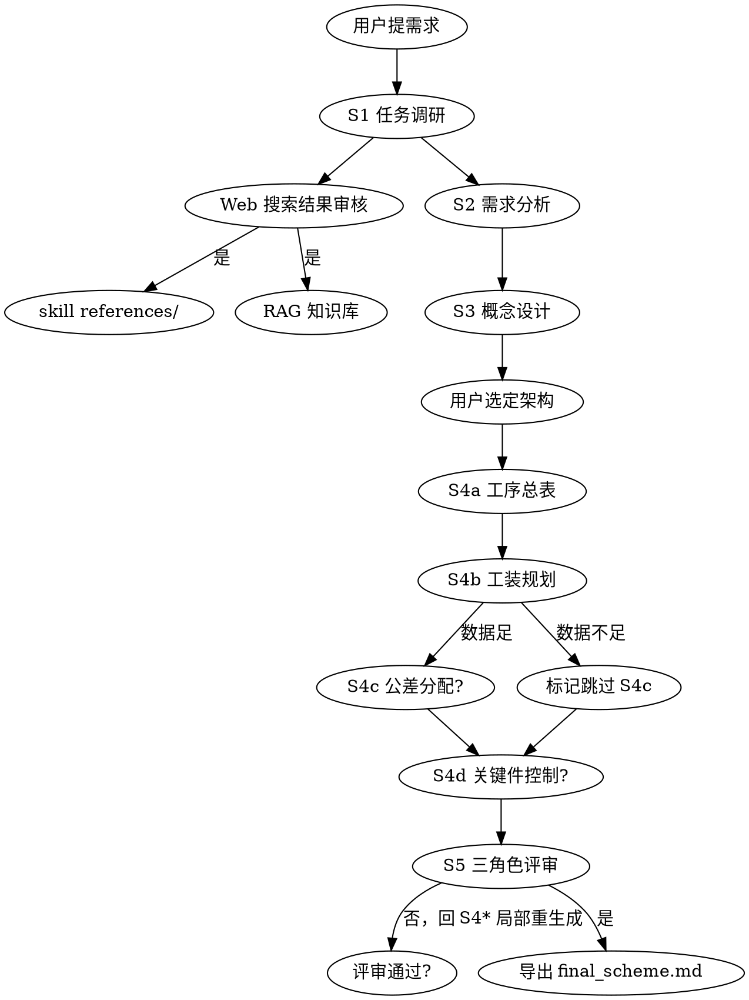

# 航空发动机装配方案设计 Skill

## 触发与不触发

**触发**：装配方案、装配工艺规程、装配顺序设计、工装规划、QC 点设置、关键尺寸链、装配公差分配、关键件特殊控制
**不触发**：单点工艺问题（直接用 RAG 回答）、KG 构建本身（用 KgBuilder）、整机总体设计

## 核心 Checklist（每阶段必做）

- [ ] 读取上一阶段 JSON 产物（S1 除外）
- [ ] 加载对应 `methodology/sN_*.md` 作为方法论上下文
- [ ] 按 `prompts/sN_*.prompt.md` 模板执行
- [ ] 产物校验通过 `templates/schemas/stage{stage_key}.schema.json`
- [ ] HITL 暂停，等待用户编辑或自然语言指导意见
- [ ] 用户确认后写入 `storage/assembly_schemes/{scheme_id}/stage{stage_key}.json`

## 5 阶段决策图

## 关键反模式

- ❌ **跳过 S2 直接出工序**：会丢失需求追溯，QC 覆盖不全
- ❌ **S3 只给 1 个架构**：违反"概念设计需多备选"原则，至少 3 个
- ❌ **S4a 一次性生成全部工序展开**：token 爆炸 + 工序间冲突难检测，应先总表后展开
- ❌ **把 Web 搜索结果直接当事实写入产物**：必须先经用户审核
- ❌ **S4c/S4d 数据不足却强行编造**：必须明确标记 `skipped: true` + `skip_reason`
- ❌ **公差链分析省略**：航发装配的灵魂——叶尖间隙、轴向间隙等关键间隙必须做 stack-up
- ❌ **不做 DFM/DFA 评分**：零件设计有 DFA 缺陷不可能装出好方案

## 5 阶段产物 ID 约定

| 阶段 | stage_key | 产物文件 | Schema |
|------|-----------|----------|--------|
| S1 任务调研 | `1` | `stage1.json` | `stage1.schema.json` |
| S2 需求分析 | `2` | `stage2.json` | `stage2.schema.json` |
| S3 概念设计 | `3` | `stage3.json` | `stage3.schema.json` |
| S4a 工序总表 | `4a` | `stage4a.json` | `stage4a.schema.json` |
| S4b 工装规划 | `4b` | `stage4b.json` | `stage4b.schema.json` |
| S4c 公差分配（可跳过） | `4c` | `stage4c.json` | `stage4c.schema.json` |
| S4d 关键件控制（可跳过） | `4d` | `stage4d.json` | `stage4d.schema.json` |
| S5 评审导出 | `5` | `stage5.json` + `final_scheme.md` | `stage5.schema.json` |

## 工具调度（Layer 2 责任）

| 工具 | 来源 | 用于阶段 |
|------|------|---------|
| `kg_query` | Neo4j (existing) | S1, S3, S4a, S4b |
| `rag_search` | Qdrant + BM25 (existing) | S1, S4a-d |
| `cad_query` | pythonocc (existing) | S3, S4c |
| `web_search` | Tavily wrapper (new) | S1, S5 (按需) |
| `vision_describe` | MiniMax Vision (existing) | S1 (用户上传草图时) |

## 反哺写入规则

Web 搜索结果经用户审核后，根据"目的地"标签写入：
- `references/`：方法论/标准条款级 → 写 markdown + 在 `_index.md` 追加索引
- `data/web_corpus/{topic}/`：具体事实级 → 走 `/ingest/pipeline` 入库到 RAG

每条写入记录追加到 `references/_ingest_log.json`。
